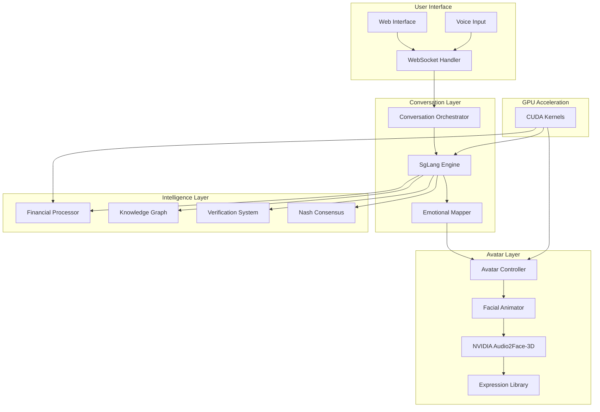

# Digital Human System

## Overview

The AIQToolkit Digital Human System provides an advanced conversational AI interface featuring NVIDIA Audio2Face-3D integration, real-time emotion rendering, and financial expertise capabilities. The system is designed for high-engagement interactions with GPU-accelerated processing.

## Architecture



## Core Components

### 1. Conversation Orchestrator

The conversation orchestrator manages the flow of interactions between users and the digital human:

```python
# src/aiq/digital_human/orchestrator/digital_human_orchestrator.py

from typing import Dict, Any, Optional
import asyncio

class DigitalHumanOrchestrator:
    def __init__(self, config: Dict[str, Any]):
        self.conversation_engine = SgLangConversationEngine(config)
        self.avatar_controller = AvatarController(config)
        self.emotional_mapper = EmotionalMapper()
        self.financial_processor = FinancialDataProcessor()
        
    async def process_interaction(
        self,
        user_input: str,
        session_id: str,
        context: Optional[Dict[str, Any]] = None
    ) -> Dict[str, Any]:
        """Process user interaction with emotion and avatar control"""
        
        # Generate response with verification
        response = await self.conversation_engine.generate_response(
            user_input, context
        )
        
        # Map emotions from response
        emotions = self.emotional_mapper.map_emotions(response)
        
        # Control avatar based on emotions
        avatar_state = await self.avatar_controller.update_avatar(
            emotions, response
        )
        
        return {
            "response": response.text,
            "emotions": emotions,
            "avatar_state": avatar_state,
            "verification": response.verification_result
        }
```

### 2. Avatar System

The avatar system handles visual representation and emotion rendering:

```python
# src/aiq/digital_human/avatar/avatar_controller.py

import numpy as np
from typing import Dict, List, Any

class AvatarController:
    def __init__(self, config: Dict[str, Any]):
        self.facial_animator = FacialAnimator()
        self.expression_library = ExpressionLibrary()
        self.audio2face = Audio2Face3DIntegration(config)
        
    async def update_avatar(
        self,
        emotions: Dict[str, float],
        response: ConversationResponse
    ) -> Dict[str, Any]:
        """Update avatar state based on emotions and response"""
        
        # Generate facial animation
        animation = self.facial_animator.generate_animation(
            emotions,
            response.audio_features
        )
        
        # Apply Audio2Face-3D processing
        audio2face_output = await self.audio2face.process(
            response.audio,
            animation
        )
        
        # Blend with emotion expressions
        final_animation = self.blend_animations(
            audio2face_output,
            self.expression_library.get_expression(emotions)
        )
        
        return {
            "animation": final_animation,
            "emotions": emotions,
            "lip_sync": audio2face_output.lip_sync
        }
```

### 3. NVIDIA Audio2Face-3D Integration

Integration with NVIDIA's advanced facial animation technology:

```python
# src/aiq/digital_human/nvidia_integration/audio2face_integration.py

from typing import Dict, Any
import grpc
import nvidia_audio2face_pb2 as a2f_pb2

class Audio2Face3DIntegration:
    def __init__(self, config: Dict[str, Any]):
        self.config = config
        self.channel = grpc.insecure_channel(config["audio2face_server"])
        self.stub = a2f_pb2.Audio2FaceStub(self.channel)
        
    async def process(
        self,
        audio_data: bytes,
        base_animation: Dict[str, Any]
    ) -> Audio2FaceOutput:
        """Process audio through Audio2Face-3D"""
        
        # Prepare request
        request = a2f_pb2.ProcessRequest(
            audio=audio_data,
            sample_rate=self.config["sample_rate"],
            emotion_weights=self._convert_emotions(base_animation)
        )
        
        # Call Audio2Face service
        response = await self.stub.Process(request)
        
        # Convert response to animation data
        return Audio2FaceOutput(
            lip_sync=self._parse_lip_sync(response.lip_sync),
            facial_curves=self._parse_facial_curves(response.curves),
            blend_shapes=self._parse_blend_shapes(response.blend_shapes)
        )
```

## Configuration

### Digital Human Configuration

```yaml
# config/digital_human.yml

digital_human:
  # Conversation settings
  conversation:
    engine: "sglang"
    model: "llama3:70b"
    temperature: 0.7
    max_tokens: 500
    
  # Avatar settings
  avatar:
    model: "realistic_human_v2"
    resolution: "1920x1080"
    fps: 30
    emotion_blend_speed: 0.3
    
  # Audio2Face settings
  audio2face:
    server: "localhost:50051"
    version: "3.0"
    quality: "high"
    enable_eye_tracking: true
    enable_wrinkle_maps: true
    
  # Emotion mapping
  emotions:
    joy_threshold: 0.7
    confidence_threshold: 0.8
    surprise_threshold: 0.6
    
  # Performance settings
  gpu:
    device: "cuda:0"
    memory_fraction: 0.8
    batch_size: 1
```

## Features

### 1. Real-time Emotion Rendering

The system provides sophisticated emotion mapping and rendering:

```python
# src/aiq/digital_human/conversation/emotional_mapper.py

from typing import Dict, Any
import torch

class EmotionalMapper:
    def __init__(self):
        self.emotion_model = self.load_emotion_model()
        self.emotion_categories = [
            "joy", "confidence", "surprise", 
            "thoughtfulness", "concern"
        ]
        
    def map_emotions(
        self, 
        response: ConversationResponse
    ) -> Dict[str, float]:
        """Map response to emotion weights"""
        
        # Extract features from response
        features = self.extract_emotional_features(response)
        
        # Run emotion classification
        with torch.no_grad():
            emotion_logits = self.emotion_model(features)
            emotion_weights = torch.softmax(emotion_logits, dim=-1)
            
        # Create emotion dictionary
        emotions = {}
        for i, category in enumerate(self.emotion_categories):
            emotions[category] = float(emotion_weights[0, i])
            
        # Apply context-based adjustments
        emotions = self.apply_context_adjustments(
            emotions, response.context
        )
        
        return emotions
```

### 2. Financial Expertise Integration

Specialized processing for financial conversations:

```python
# src/aiq/digital_human/financial/financial_data_processor.py

from typing import Dict, Any, List
import pandas as pd

class FinancialDataProcessor:
    def __init__(self):
        self.market_data_provider = MarketDataProvider()
        self.portfolio_optimizer = PortfolioOptimizer()
        self.risk_engine = RiskAssessmentEngine()
        
    async def process_financial_query(
        self,
        query: str,
        context: Dict[str, Any]
    ) -> FinancialResponse:
        """Process financial queries with real-time data"""
        
        # Extract financial entities
        entities = await self.extract_financial_entities(query)
        
        # Get market data
        market_data = await self.market_data_provider.get_data(
            entities.tickers
        )
        
        # Perform analysis based on query type
        if entities.query_type == "portfolio_optimization":
            result = await self.portfolio_optimizer.optimize(
                entities.portfolio,
                market_data
            )
        elif entities.query_type == "risk_assessment":
            result = await self.risk_engine.assess_risk(
                entities.positions,
                market_data
            )
        else:
            result = await self.general_analysis(
                entities, market_data
            )
            
        return FinancialResponse(
            analysis=result,
            visualizations=self.create_visualizations(result),
            recommendations=self.generate_recommendations(result)
        )
```

### 3. Multi-modal Interaction

Support for voice, text, and visual inputs:

```python
# src/aiq/digital_human/ui/multimodal_handler.py

class MultiModalHandler:
    def __init__(self):
        self.voice_processor = VoiceProcessor()
        self.gesture_recognizer = GestureRecognizer()
        self.text_processor = TextProcessor()
        
    async def process_multimodal_input(
        self,
        inputs: Dict[str, Any]
    ) -> ProcessedInput:
        """Process multiple input modalities"""
        
        processed = ProcessedInput()
        
        # Process voice if present
        if "audio" in inputs:
            voice_result = await self.voice_processor.process(
                inputs["audio"]
            )
            processed.text = voice_result.transcription
            processed.prosody = voice_result.prosody
            
        # Process text
        if "text" in inputs:
            text_result = await self.text_processor.process(
                inputs["text"]
            )
            processed.text = text_result.normalized_text
            processed.intent = text_result.intent
            
        # Process gestures
        if "video" in inputs:
            gesture_result = await self.gesture_recognizer.process(
                inputs["video"]
            )
            processed.gestures = gesture_result.gestures
            
        return processed
```

## Deployment

### Production Deployment Architecture

```yaml
# kubernetes/digital-human-production.yaml

apiVersion: apps/v1
kind: Deployment
metadata:
  name: digital-human-production
spec:
  replicas: 3
  selector:
    matchLabels:
      app: digital-human
  template:
    metadata:
      labels:
        app: digital-human
    spec:
      nodeSelector:
        nvidia.com/gpu: "true"
        gpu.nvidia.com/model: "a100"
      containers:
      - name: conversation-engine
        image: aiqtoolkit/digital-human:latest
        resources:
          requests:
            memory: "16Gi"
            cpu: "8"
            nvidia.com/gpu: 1
          limits:
            memory: "32Gi"
            cpu: "16"
            nvidia.com/gpu: 1
        env:
        - name: MODEL
          value: "llama3:70b"
        - name: AUDIO2FACE_SERVER
          value: "audio2face-service:50051"
      - name: audio2face
        image: nvidia/audio2face:3.0
        resources:
          requests:
            memory: "8Gi"
            cpu: "4"
            nvidia.com/gpu: 1
          limits:
            memory: "16Gi"
            cpu: "8"
            nvidia.com/gpu: 1
---
apiVersion: v1
kind: Service
metadata:
  name: digital-human-service
spec:
  selector:
    app: digital-human
  ports:
  - name: http
    port: 8000
    targetPort: 8000
  - name: websocket
    port: 8080
    targetPort: 8080
  type: LoadBalancer
```

### Scaling Configuration

```python
# src/aiq/digital_human/scalability/load_balancer.py

class DigitalHumanLoadBalancer:
    def __init__(self, config: Dict[str, Any]):
        self.instances = []
        self.config = config
        self.health_checker = HealthChecker()
        
    async def route_request(
        self,
        request: Dict[str, Any]
    ) -> DigitalHumanInstance:
        """Route request to optimal instance"""
        
        # Get healthy instances
        healthy_instances = await self.health_checker.get_healthy(
            self.instances
        )
        
        # Select instance based on load
        instance = self.select_instance(
            healthy_instances,
            request
        )
        
        # Handle GPU affinity for session
        if request.get("session_id"):
            instance = self.get_session_instance(
                request["session_id"]
            ) or instance
            
        return instance
        
    def select_instance(
        self,
        instances: List[DigitalHumanInstance],
        request: Dict[str, Any]
    ) -> DigitalHumanInstance:
        """Select optimal instance based on load"""
        
        # Get instance metrics
        metrics = []
        for instance in instances:
            metrics.append({
                "instance": instance,
                "gpu_util": instance.gpu_utilization,
                "memory_util": instance.memory_utilization,
                "queue_size": instance.queue_size
            })
            
        # Sort by combined score
        metrics.sort(
            key=lambda x: (
                x["gpu_util"] * 0.4 + 
                x["memory_util"] * 0.3 + 
                x["queue_size"] * 0.3
            )
        )
        
        return metrics[0]["instance"]
```

## Performance Optimization

### GPU Acceleration

```python
# src/aiq/digital_human/performance/gpu_optimizer.py

import torch
import torch.cuda as cuda

class DigitalHumanGPUOptimizer:
    def __init__(self):
        self.device = torch.device("cuda:0")
        self.stream = cuda.Stream()
        
    def optimize_inference(self, model: torch.nn.Module):
        """Optimize model for inference"""
        
        # Enable mixed precision
        model = model.half()
        
        # Compile with torch.compile
        model = torch.compile(
            model,
            mode="max-performance",
            fullgraph=True
        )
        
        # Enable CUDA graphs
        if hasattr(model, "enable_cuda_graph"):
            model.enable_cuda_graph()
            
        return model
        
    async def parallel_process(
        self,
        tasks: List[callable],
        batch_size: int = 4
    ) -> List[Any]:
        """Process tasks in parallel on GPU"""
        
        results = []
        
        with cuda.stream(self.stream):
            for i in range(0, len(tasks), batch_size):
                batch = tasks[i:i+batch_size]
                
                # Process batch in parallel
                batch_results = await asyncio.gather(*[
                    self._gpu_task(task) for task in batch
                ])
                
                results.extend(batch_results)
                
        return results
```

### Latency Optimization

```python
# src/aiq/digital_human/performance/latency_optimizer.py

from typing import Dict, Any
import asyncio

class LatencyOptimizer:
    def __init__(self):
        self.response_cache = TTLCache(maxsize=1000, ttl=60)
        self.precomputed_animations = {}
        
    async def optimize_response_time(
        self,
        request: Dict[str, Any]
    ) -> Dict[str, Any]:
        """Optimize response time through various techniques"""
        
        # Check cache first
        cache_key = self.get_cache_key(request)
        if cache_key in self.response_cache:
            return self.response_cache[cache_key]
            
        # Parallel processing of components
        tasks = [
            self.generate_text_response(request),
            self.generate_avatar_animation(request),
            self.process_emotions(request)
        ]
        
        results = await asyncio.gather(*tasks)
        
        response = {
            "text": results[0],
            "animation": results[1],
            "emotions": results[2]
        }
        
        # Cache response
        self.response_cache[cache_key] = response
        
        return response
```

## Monitoring

### Performance Metrics

```python
# src/aiq/digital_human/monitoring/metrics_collector.py

from prometheus_client import Counter, Histogram, Gauge

class DigitalHumanMetrics:
    def __init__(self):
        # Response time metrics
        self.response_time = Histogram(
            'digital_human_response_time_seconds',
            'Response time for digital human interactions',
            ['interaction_type']
        )
        
        # GPU utilization
        self.gpu_utilization = Gauge(
            'digital_human_gpu_utilization',
            'GPU utilization percentage',
            ['device']
        )
        
        # Emotion processing
        self.emotion_accuracy = Gauge(
            'digital_human_emotion_accuracy',
            'Emotion detection accuracy'
        )
        
        # Active sessions
        self.active_sessions = Gauge(
            'digital_human_active_sessions',
            'Number of active sessions'
        )
        
    async def collect_metrics(self):
        """Collect all metrics"""
        
        # GPU metrics
        for i in range(torch.cuda.device_count()):
            util = torch.cuda.utilization(i)
            self.gpu_utilization.labels(device=f"cuda:{i}").set(util)
            
        # Session metrics
        active = self.count_active_sessions()
        self.active_sessions.set(active)
```

## Best Practices

1. **Session Management**: Maintain GPU affinity for user sessions
2. **Emotion Calibration**: Regularly calibrate emotion detection models
3. **Audio Quality**: Ensure high-quality audio input for Audio2Face
4. **Context Persistence**: Maintain conversation context across sessions
5. **Error Recovery**: Implement graceful fallbacks for component failures
6. **Performance Monitoring**: Monitor GPU utilization and response times

## Troubleshooting

### Common Issues

1. **High latency**: Check GPU utilization and batch sizes
2. **Audio sync issues**: Verify Audio2Face configuration
3. **Emotion mismatch**: Calibrate emotion detection thresholds
4. **Memory errors**: Adjust model precision and batch sizes

### Debug Commands

```bash
# Check digital human status
aiq digital-human status

# Monitor GPU usage
nvidia-smi -l 1

# Test Audio2Face connection
aiq test audio2face --server localhost:50051

# Analyze performance
aiq profile digital-human --duration 60

# View logs
kubectl logs -f deployment/digital-human -c conversation-engine
```

## Next Steps

- Review [Technical Guide](technical-guide.md) for detailed implementation
- See [Deployment Guide](deployment.md) for production setup
- Explore [Examples](examples.md) for use cases