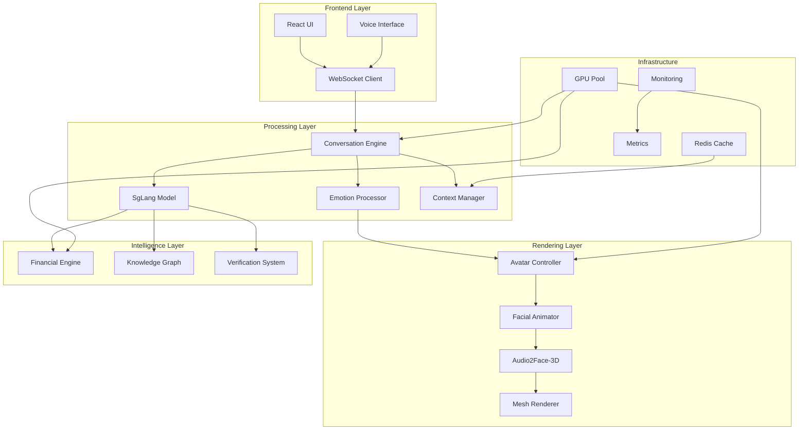

# Digital Human Technical Guide

## System Architecture

### Component Overview

The Digital Human system consists of several interconnected components working in harmony:



## Core Implementation

### 1. SgLang Conversation Engine

The heart of the digital human's conversational abilities:

```python
# src/aiq/digital_human/conversation/sglang_engine.py

from typing import Dict, Any, List, Optional
import sglang as sgl
import torch

class SgLangConversationEngine:
    def __init__(self, config: SgLangConfig):
        self.config = config
        self.model = self._initialize_model()
        self.context_manager = ContextManager(config.context_size)
        self.verification_system = VerificationSystem()
        
    def _initialize_model(self) -> sgl.Model:
        """Initialize SgLang model with optimizations"""
        
        model = sgl.Model(
            self.config.model_name,
            tp_size=self.config.tensor_parallel_size,
            cache_size=self.config.cache_size,
            quantization=self.config.quantization
        )
        
        # Apply optimizations
        if self.config.use_flash_attention:
            model.enable_flash_attention()
            
        if self.config.use_cuda_graph:
            model.enable_cuda_graph()
            
        return model
        
    @sgl.function
    def generate_response(
        self,
        user_input: str,
        context: Optional[str] = None,
        personality: str = "professional"
    ):
        """Generate response with personality and context"""
        
        sgl.user(user_input)
        
        if context:
            sgl.system(f"Context: {context}")
            
        sgl.system(f"""You are a {personality} financial advisor 
                      with expertise in market analysis and portfolio 
                      management. Provide accurate, helpful responses.""")
        
        with sgl.copy() as fork:
            # Generate multiple candidates
            sgl.assistant(
                temperature=self.config.temperature,
                max_tokens=self.config.max_tokens
            )
            
        # Select best response
        response = sgl.select(
            fork,
            criteria="helpfulness and accuracy"
        )
        
        return response
        
    async def process_with_verification(
        self,
        user_input: str,
        session_context: Dict[str, Any]
    ) -> ConversationResponse:
        """Process input with verification and context"""
        
        # Update context
        enriched_context = await self.context_manager.enrich_context(
            user_input, session_context
        )
        
        # Generate response
        response_text = await self.generate_response(
            user_input=user_input,
            context=enriched_context,
            personality=session_context.get("personality", "professional")
        )
        
        # Verify if needed
        verification_result = None
        if self._needs_verification(response_text):
            verification_result = await self.verification_system.verify(
                response_text,
                sources=session_context.get("sources", [])
            )
            
        return ConversationResponse(
            text=response_text,
            verification=verification_result,
            context=enriched_context,
            emotion_hints=self._extract_emotion_hints(response_text)
        )
```

### 2. Advanced Avatar Controller

Sophisticated avatar control with emotion blending:

```python
# src/aiq/digital_human/avatar/advanced_avatar_controller.py

import numpy as np
from typing import Dict, List, Any, Optional
import torch

class AdvancedAvatarController:
    def __init__(self, config: AvatarConfig):
        self.config = config
        self.facial_rig = FacialRig(config.model_path)
        self.emotion_blender = EmotionBlender()
        self.audio_processor = AudioProcessor()
        self.gpu_device = torch.device("cuda:0")
        
    async def generate_avatar_state(
        self,
        response: ConversationResponse,
        audio_data: bytes,
        previous_state: Optional[AvatarState] = None
    ) -> AvatarState:
        """Generate complete avatar state from response"""
        
        # Process audio for lip sync
        audio_features = await self.audio_processor.extract_features(
            audio_data
        )
        
        # Generate base facial animation
        base_animation = await self.generate_base_animation(
            audio_features,
            response.text
        )
        
        # Apply emotion blending
        emotion_weights = self.map_emotions_to_weights(
            response.emotion_hints
        )
        
        blended_animation = self.emotion_blender.blend(
            base_animation,
            emotion_weights,
            blend_factor=self.config.emotion_blend_factor
        )
        
        # Apply physics simulation
        physics_animation = self.apply_physics(
            blended_animation,
            previous_state
        )
        
        # Generate final avatar state
        avatar_state = AvatarState(
            facial_animation=physics_animation,
            head_pose=self.calculate_head_pose(emotion_weights),
            eye_gaze=self.calculate_eye_gaze(response.context),
            blend_shapes=self.facial_rig.get_blend_shapes(physics_animation),
            timestamp=time.time()
        )
        
        return avatar_state
        
    def map_emotions_to_weights(
        self,
        emotion_hints: List[str]
    ) -> Dict[str, float]:
        """Map emotion hints to blend shape weights"""
        
        # Define emotion to blend shape mappings
        emotion_mappings = {
            "happy": {"smile": 0.8, "eye_squint": 0.3},
            "confident": {"eyebrow_raise": 0.4, "chin_up": 0.2},
            "thoughtful": {"eyebrow_furrow": 0.5, "eye_narrow": 0.3},
            "concerned": {"eyebrow_furrow": 0.6, "mouth_frown": 0.3}
        }
        
        weights = {}
        for hint in emotion_hints:
            if hint in emotion_mappings:
                for shape, weight in emotion_mappings[hint].items():
                    weights[shape] = max(
                        weights.get(shape, 0), 
                        weight
                    )
                    
        return weights
        
    @torch.cuda.amp.autocast()
    def apply_physics(
        self,
        animation: FacialAnimation,
        previous_state: Optional[AvatarState]
    ) -> FacialAnimation:
        """Apply physics simulation for realistic movement"""
        
        with torch.no_grad():
            # Convert to tensor
            animation_tensor = torch.tensor(
                animation.frames,
                device=self.gpu_device
            )
            
            # Apply inertia
            if previous_state:
                prev_tensor = torch.tensor(
                    previous_state.facial_animation.frames,
                    device=self.gpu_device
                )
                
                # Calculate velocity
                velocity = animation_tensor - prev_tensor
                
                # Apply damping
                damped_velocity = velocity * self.config.damping_factor
                
                # Update animation
                animation_tensor = prev_tensor + damped_velocity
                
            # Apply constraints
            animation_tensor = self.apply_constraints(animation_tensor)
            
            # Convert back to animation
            return FacialAnimation(
                frames=animation_tensor.cpu().numpy()
            )
```

### 3. Real-time Audio2Face Integration

Advanced integration with NVIDIA Audio2Face-3D:

```python
# src/aiq/digital_human/nvidia_integration/realtime_audio2face.py

import grpc
import asyncio
from concurrent import futures
import nvidia_audio2face_3d_pb2 as a2f_pb2
import nvidia_audio2face_3d_pb2_grpc as a2f_grpc

class RealtimeAudio2Face:
    def __init__(self, config: Audio2FaceConfig):
        self.config = config
        self.channel = self._create_channel()
        self.stub = a2f_grpc.Audio2Face3DStub(self.channel)
        self.stream_processor = StreamProcessor()
        
    def _create_channel(self) -> grpc.Channel:
        """Create gRPC channel with optimizations"""
        
        options = [
            ('grpc.max_send_message_length', 100 * 1024 * 1024),
            ('grpc.max_receive_message_length', 100 * 1024 * 1024),
            ('grpc.keepalive_time_ms', 10000),
            ('grpc.keepalive_timeout_ms', 5000),
            ('grpc.http2.min_time_between_pings_ms', 10000),
        ]
        
        if self.config.use_ssl:
            credentials = grpc.ssl_channel_credentials()
            return grpc.secure_channel(
                self.config.server_address,
                credentials,
                options=options
            )
        else:
            return grpc.insecure_channel(
                self.config.server_address,
                options=options
            )
            
    async def process_audio_stream(
        self,
        audio_stream: AsyncIterator[bytes],
        emotion_stream: AsyncIterator[Dict[str, float]]
    ) -> AsyncIterator[FacialAnimation]:
        """Process streaming audio with emotions"""
        
        # Create bidirectional stream
        request_stream = self._create_request_stream(
            audio_stream,
            emotion_stream
        )
        
        response_stream = self.stub.ProcessStream(request_stream)
        
        # Process responses
        async for response in response_stream:
            animation = self._parse_response(response)
            
            # Apply post-processing
            animation = await self.stream_processor.process(
                animation,
                self.config.post_processing
            )
            
            yield animation
            
    async def _create_request_stream(
        self,
        audio_stream: AsyncIterator[bytes],
        emotion_stream: AsyncIterator[Dict[str, float]]
    ) -> AsyncIterator[a2f_pb2.StreamRequest]:
        """Create request stream from audio and emotions"""
        
        async def merged_stream():
            audio_task = asyncio.create_task(
                self._consume_stream(audio_stream)
            )
            emotion_task = asyncio.create_task(
                self._consume_stream(emotion_stream)
            )
            
            while True:
                done, pending = await asyncio.wait(
                    {audio_task, emotion_task},
                    return_when=asyncio.FIRST_COMPLETED
                )
                
                for task in done:
                    if task == audio_task:
                        audio_chunk = task.result()
                        if audio_chunk is None:
                            return
                            
                        request = a2f_pb2.StreamRequest(
                            audio_chunk=audio_chunk,
                            sample_rate=self.config.sample_rate
                        )
                        yield request
                        
                        audio_task = asyncio.create_task(
                            self._consume_stream(audio_stream)
                        )
                        
                    elif task == emotion_task:
                        emotions = task.result()
                        if emotions is None:
                            continue
                            
                        request = a2f_pb2.StreamRequest(
                            emotion_update=self._convert_emotions(emotions)
                        )
                        yield request
                        
                        emotion_task = asyncio.create_task(
                            self._consume_stream(emotion_stream)
                        )
                        
        async for request in merged_stream():
            yield request
```

### 4. Emotion Processing Pipeline

Sophisticated emotion detection and processing:

```python
# src/aiq/digital_human/emotion/emotion_pipeline.py

import torch
import torch.nn as nn
from transformers import AutoModel, AutoTokenizer
from typing import Dict, List, Any

class EmotionProcessingPipeline:
    def __init__(self, config: EmotionConfig):
        self.config = config
        self.text_emotion_model = self._load_text_model()
        self.voice_emotion_model = self._load_voice_model()
        self.fusion_model = self._load_fusion_model()
        
    def _load_text_model(self) -> nn.Module:
        """Load text emotion detection model"""
        
        model = AutoModel.from_pretrained(
            self.config.text_model_name
        )
        
        # Add emotion classification head
        model.classifier = nn.Sequential(
            nn.Linear(model.config.hidden_size, 512),
            nn.ReLU(),
            nn.Dropout(0.2),
            nn.Linear(512, len(self.config.emotion_classes))
        )
        
        model = model.to(self.config.device)
        model.eval()
        
        return model
        
    async def process_multimodal_emotions(
        self,
        text: str,
        audio_features: Dict[str, Any],
        visual_features: Optional[Dict[str, Any]] = None
    ) -> EmotionResult:
        """Process emotions from multiple modalities"""
        
        # Text emotion detection
        text_emotions = await self._detect_text_emotions(text)
        
        # Voice emotion detection
        voice_emotions = await self._detect_voice_emotions(
            audio_features
        )
        
        # Visual emotion detection (if available)
        visual_emotions = None
        if visual_features:
            visual_emotions = await self._detect_visual_emotions(
                visual_features
            )
            
        # Fuse emotions from all modalities
        fused_emotions = await self._fuse_emotions(
            text_emotions,
            voice_emotions,
            visual_emotions
        )
        
        # Apply temporal smoothing
        smoothed_emotions = self._temporal_smoothing(
            fused_emotions,
            self.config.smoothing_window
        )
        
        return EmotionResult(
            primary_emotion=self._get_primary_emotion(smoothed_emotions),
            emotion_weights=smoothed_emotions,
            confidence=self._calculate_confidence(smoothed_emotions),
            modality_contributions={
                "text": text_emotions,
                "voice": voice_emotions,
                "visual": visual_emotions
            }
        )
        
    async def _detect_text_emotions(
        self,
        text: str
    ) -> Dict[str, float]:
        """Detect emotions from text"""
        
        with torch.no_grad():
            # Tokenize text
            inputs = self.tokenizer(
                text,
                return_tensors="pt",
                padding=True,
                truncation=True,
                max_length=512
            ).to(self.config.device)
            
            # Get embeddings
            outputs = self.text_emotion_model.base_model(**inputs)
            embeddings = outputs.last_hidden_state.mean(dim=1)
            
            # Classify emotions
            logits = self.text_emotion_model.classifier(embeddings)
            probs = torch.softmax(logits, dim=-1)
            
            # Convert to dictionary
            emotions = {}
            for i, emotion in enumerate(self.config.emotion_classes):
                emotions[emotion] = float(probs[0, i])
                
        return emotions
```

### 5. Performance Optimization

Advanced performance optimization techniques:

```python
# src/aiq/digital_human/optimization/performance_optimizer.py

import torch
import torch._dynamo as dynamo
from torch.cuda.amp import autocast, GradScaler
from typing import Dict, Any, List

class PerformanceOptimizer:
    def __init__(self, config: OptimizationConfig):
        self.config = config
        self.scaler = GradScaler() if config.use_amp else None
        self.graph_cache = {}
        
    def optimize_model(self, model: nn.Module) -> nn.Module:
        """Apply comprehensive model optimizations"""
        
        # Compile with torch.compile
        if self.config.use_torch_compile:
            model = torch.compile(
                model,
                mode=self.config.compile_mode,
                dynamic=self.config.dynamic_shapes,
                fullgraph=self.config.fullgraph
            )
            
        # Enable CUDA graphs
        if self.config.use_cuda_graphs:
            model = self._enable_cuda_graphs(model)
            
        # Optimize memory usage
        if self.config.optimize_memory:
            model = self._optimize_memory(model)
            
        # Enable mixed precision
        if self.config.use_amp:
            model = self._enable_mixed_precision(model)
            
        return model
        
    def _enable_cuda_graphs(self, model: nn.Module) -> nn.Module:
        """Enable CUDA graphs for static computation"""
        
        class CUDAGraphWrapper(nn.Module):
            def __init__(self, module):
                super().__init__()
                self.module = module
                self.graph = None
                self.static_inputs = None
                self.static_outputs = None
                
            def forward(self, *args, **kwargs):
                if self.training:
                    return self.module(*args, **kwargs)
                    
                # Check if we can use cached graph
                if self.graph is not None:
                    # Copy inputs to static tensors
                    for i, arg in enumerate(args):
                        self.static_inputs[i].copy_(arg)
                        
                    # Replay graph
                    self.graph.replay()
                    
                    # Return copies of outputs
                    return [out.clone() for out in self.static_outputs]
                    
                # Record new graph
                self.static_inputs = [arg.clone() for arg in args]
                
                # Warmup
                s = torch.cuda.Stream()
                s.wait_stream(torch.cuda.current_stream())
                
                with torch.cuda.stream(s):
                    for _ in range(3):
                        self.module(*self.static_inputs)
                        
                torch.cuda.current_stream().wait_stream(s)
                
                # Record graph
                self.graph = torch.cuda.CUDAGraph()
                with torch.cuda.graph(self.graph):
                    self.static_outputs = self.module(*self.static_inputs)
                    
                return [out.clone() for out in self.static_outputs]
                
        return CUDAGraphWrapper(model)
        
    def optimize_inference_pipeline(
        self,
        pipeline: List[nn.Module]
    ) -> List[nn.Module]:
        """Optimize entire inference pipeline"""
        
        optimized_pipeline = []
        
        for i, module in enumerate(pipeline):
            # Apply module-specific optimizations
            if isinstance(module, TransformerModel):
                module = self._optimize_transformer(module)
            elif isinstance(module, ConvolutionalModel):
                module = self._optimize_cnn(module)
                
            # Apply general optimizations
            module = self.optimize_model(module)
            
            optimized_pipeline.append(module)
            
        # Enable pipeline parallelism if possible
        if len(optimized_pipeline) > 1 and self.config.use_pipeline_parallel:
            optimized_pipeline = self._enable_pipeline_parallel(
                optimized_pipeline
            )
            
        return optimized_pipeline
```

## Advanced Features

### 1. Knowledge-Enhanced Responses

Integration with knowledge graph for accurate information:

```python
# src/aiq/digital_human/knowledge/knowledge_enhanced_response.py

class KnowledgeEnhancedResponse:
    def __init__(self):
        self.knowledge_graph = JenaDatabase()
        self.entity_extractor = EntityExtractor()
        self.fact_checker = FactChecker()
        
    async def enhance_response(
        self,
        base_response: str,
        query: str,
        context: Dict[str, Any]
    ) -> EnhancedResponse:
        """Enhance response with knowledge graph data"""
        
        # Extract entities from query and response
        query_entities = await self.entity_extractor.extract(query)
        response_entities = await self.entity_extractor.extract(
            base_response
        )
        
        # Query knowledge graph
        relevant_facts = await self.query_relevant_facts(
            query_entities + response_entities
        )
        
        # Fact-check response
        fact_check_result = await self.fact_checker.check(
            base_response,
            relevant_facts
        )
        
        # Enhance response with verified facts
        enhanced_text = self.inject_verified_facts(
            base_response,
            fact_check_result.verified_facts
        )
        
        # Add citations
        enhanced_text = self.add_citations(
            enhanced_text,
            fact_check_result.sources
        )
        
        return EnhancedResponse(
            text=enhanced_text,
            facts=fact_check_result.verified_facts,
            confidence=fact_check_result.confidence,
            sources=fact_check_result.sources
        )
```

### 2. Multi-Language Support

Support for multiple languages with emotion preservation:

```python
# src/aiq/digital_human/multilingual/language_processor.py

class MultilingualProcessor:
    def __init__(self, config: LanguageConfig):
        self.config = config
        self.translators = self._load_translators()
        self.emotion_preservers = self._load_emotion_preservers()
        
    async def process_multilingual_input(
        self,
        text: str,
        source_lang: str,
        target_lang: str = "en"
    ) -> MultilingualResult:
        """Process input in any language"""
        
        # Detect emotions in source language
        source_emotions = await self.detect_emotions(text, source_lang)
        
        # Translate to target language
        translated_text = await self.translate(
            text,
            source_lang,
            target_lang
        )
        
        # Preserve emotional markers
        emotionally_preserved = await self.preserve_emotions(
            translated_text,
            source_emotions,
            target_lang
        )
        
        # Generate response in target language
        response = await self.generate_response(
            emotionally_preserved,
            target_lang
        )
        
        # Translate back to source language if needed
        if source_lang != target_lang:
            response = await self.translate(
                response,
                target_lang,
                source_lang
            )
            
        return MultilingualResult(
            original_text=text,
            translated_text=translated_text,
            response=response,
            source_emotions=source_emotions,
            preserved_emotions=emotionally_preserved
        )
```

### 3. Adaptive Personality System

Dynamic personality adaptation based on context:

```python
# src/aiq/digital_human/personality/adaptive_personality.py

class AdaptivePersonalitySystem:
    def __init__(self, config: PersonalityConfig):
        self.config = config
        self.personality_encoder = PersonalityEncoder()
        self.adaptation_model = AdaptationModel()
        
    async def adapt_personality(
        self,
        user_profile: UserProfile,
        conversation_context: ConversationContext,
        current_topic: str
    ) -> PersonalityVector:
        """Adapt personality to user and context"""
        
        # Encode base personality
        base_personality = self.personality_encoder.encode(
            self.config.base_personality
        )
        
        # Analyze user preferences
        user_preferences = await self.analyze_user_preferences(
            user_profile
        )
        
        # Context-based adjustments
        context_adjustments = self.calculate_context_adjustments(
            conversation_context,
            current_topic
        )
        
        # Apply adaptation model
        adapted_personality = self.adaptation_model.adapt(
            base_personality,
            user_preferences,
            context_adjustments
        )
        
        # Ensure personality coherence
        coherent_personality = self.ensure_coherence(
            adapted_personality,
            conversation_context.personality_history
        )
        
        return PersonalityVector(
            traits=coherent_personality,
            confidence=self.calculate_confidence(coherent_personality),
            adjustments=context_adjustments
        )
```

## Performance Benchmarks

### Latency Measurements

```python
# benchmarks/digital_human_latency.py

class DigitalHumanBenchmark:
    def __init__(self):
        self.metrics = {}
        
    async def benchmark_full_pipeline(self):
        """Benchmark complete digital human pipeline"""
        
        test_input = "What's the current market outlook?"
        
        # Measure component latencies
        start = time.time()
        
        # Speech recognition
        sr_start = time.time()
        text = await self.speech_recognizer.recognize(test_audio)
        self.metrics['speech_recognition'] = time.time() - sr_start
        
        # Response generation
        gen_start = time.time()
        response = await self.conversation_engine.generate(text)
        self.metrics['response_generation'] = time.time() - gen_start
        
        # Emotion processing
        emo_start = time.time()
        emotions = await self.emotion_processor.process(response)
        self.metrics['emotion_processing'] = time.time() - emo_start
        
        # Avatar animation
        anim_start = time.time()
        animation = await self.avatar_controller.animate(
            response, emotions
        )
        self.metrics['avatar_animation'] = time.time() - anim_start
        
        # Audio2Face processing
        a2f_start = time.time()
        facial_animation = await self.audio2face.process(
            response.audio, animation
        )
        self.metrics['audio2face'] = time.time() - a2f_start
        
        # Total pipeline time
        self.metrics['total_pipeline'] = time.time() - start
        
        return self.metrics
```

### GPU Utilization

```python
# benchmarks/gpu_utilization.py

class GPUUtilizationBenchmark:
    def __init__(self):
        self.gpu_monitor = GPUMonitor()
        
    async def measure_utilization(self):
        """Measure GPU utilization during processing"""
        
        metrics = {
            'gpu_compute': [],
            'gpu_memory': [],
            'tensor_cores': []
        }
        
        # Start monitoring
        monitoring_task = asyncio.create_task(
            self.gpu_monitor.monitor(metrics)
        )
        
        # Run workload
        await self.run_digital_human_workload()
        
        # Stop monitoring
        monitoring_task.cancel()
        
        # Calculate statistics
        return {
            'avg_compute': np.mean(metrics['gpu_compute']),
            'max_compute': np.max(metrics['gpu_compute']),
            'avg_memory': np.mean(metrics['gpu_memory']),
            'max_memory': np.max(metrics['gpu_memory']),
            'tensor_core_usage': np.mean(metrics['tensor_cores'])
        }
```

## Debugging and Monitoring

### Debug Tools

```python
# src/aiq/digital_human/debug/debug_tools.py

class DigitalHumanDebugger:
    def __init__(self):
        self.logger = logging.getLogger(__name__)
        self.profiler = Profiler()
        
    def debug_conversation_flow(
        self,
        conversation_id: str
    ):
        """Debug conversation flow with detailed logging"""
        
        # Enable detailed logging
        self.logger.setLevel(logging.DEBUG)
        
        # Create debug context
        debug_context = {
            'conversation_id': conversation_id,
            'timestamps': {},
            'intermediate_results': {}
        }
        
        # Hook into conversation pipeline
        self.hook_pipeline_stages(debug_context)
        
        # Generate debug report
        return self.generate_debug_report(debug_context)
        
    def profile_performance(
        self,
        duration: int = 60
    ):
        """Profile digital human performance"""
        
        with self.profiler.profile():
            # Run test workload
            asyncio.run(self.run_test_workload(duration))
            
        # Generate performance report
        return self.profiler.generate_report()
```

### Monitoring Dashboard

```python
# src/aiq/digital_human/monitoring/dashboard.py

class DigitalHumanDashboard:
    def __init__(self):
        self.metrics_collector = MetricsCollector()
        self.visualizer = DashboardVisualizer()
        
    async def create_dashboard(self):
        """Create monitoring dashboard"""
        
        dashboard = {
            'panels': [
                {
                    'title': 'Response Latency',
                    'type': 'graph',
                    'metrics': ['response_time_p50', 'response_time_p99']
                },
                {
                    'title': 'GPU Utilization',
                    'type': 'gauge',
                    'metrics': ['gpu_compute', 'gpu_memory']
                },
                {
                    'title': 'Emotion Distribution',
                    'type': 'pie',
                    'metrics': ['emotion_distribution']
                },
                {
                    'title': 'Active Sessions',
                    'type': 'counter',
                    'metrics': ['active_sessions']
                }
            ]
        }
        
        # Start real-time updates
        await self.start_real_time_updates(dashboard)
        
        return dashboard
```

## Best Practices

1. **Model Optimization**
   - Use quantization for inference
   - Enable CUDA graphs for static computations
   - Implement model caching

2. **Memory Management**
   - Use memory pooling for tensors
   - Implement garbage collection strategies
   - Monitor memory usage

3. **Latency Optimization**
   - Parallelize independent operations
   - Use streaming where possible
   - Implement response caching

4. **Error Handling**
   - Graceful degradation for component failures
   - Implement circuit breakers
   - Comprehensive error logging

5. **Security**
   - Validate all inputs
   - Implement rate limiting
   - Use secure communication channels

## Next Steps

- Review [Deployment Guide](deployment.md) for production setup
- Explore [Examples](examples.md) for implementation patterns
- See [Performance Guide](../performance/index.md) for optimization