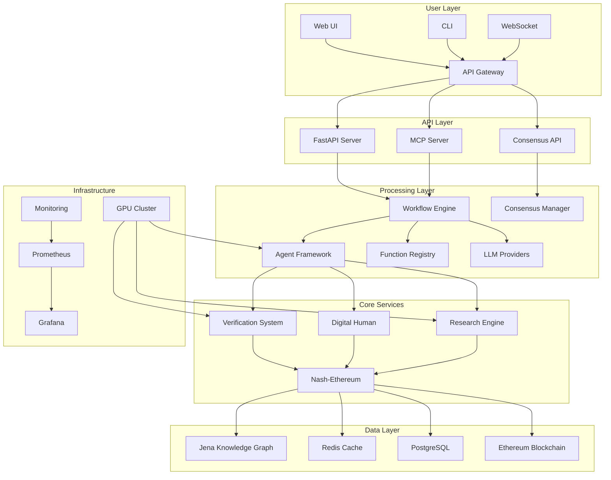
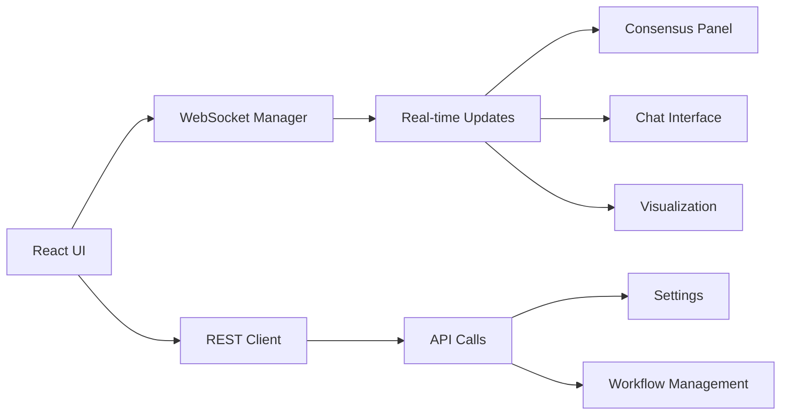
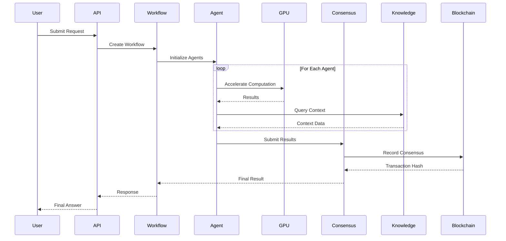

# AIQToolkit System Architecture

## Overview

AIQToolkit implements a sophisticated multi-layer architecture that combines GPU acceleration, blockchain consensus, semantic knowledge graphs, and neural-symbolic AI. This document provides a comprehensive view of the system architecture and component interactions.

## High-Level Architecture



## Component Architecture

### 1. Frontend Architecture



### 2. Backend Services Architecture

```python
# src/aiq/server/architecture.py

from fastapi import FastAPI
from typing import Dict, Any
import asyncio

class AIQToolkitArchitecture:
    def __init__(self):
        self.components = {
            "api_server": FastAPIServer(),
            "workflow_engine": WorkflowEngine(),
            "agent_manager": AgentManager(),
            "consensus_service": ConsensusService(),
            "knowledge_service": KnowledgeService(),
            "gpu_accelerator": GPUAccelerator(),
            "monitoring": MonitoringService()
        }
        
    async def initialize(self):
        """Initialize all system components"""
        
        # Initialize core services
        await self.components["gpu_accelerator"].initialize()
        await self.components["knowledge_service"].connect()
        
        # Initialize processing layer
        await self.components["workflow_engine"].setup()
        await self.components["agent_manager"].register_agents()
        
        # Initialize API layer
        await self.components["api_server"].start()
        
        # Start monitoring
        await self.components["monitoring"].start_collection()
        
    def get_system_status(self) -> Dict[str, Any]:
        """Get status of all components"""
        
        return {
            name: component.get_status()
            for name, component in self.components.items()
        }
```

### 3. Agent Architecture

```python
# src/aiq/architecture/agent_architecture.py

from abc import ABC, abstractmethod
from typing import List, Dict, Any

class AgentArchitecture(ABC):
    """Base architecture for all agents"""
    
    def __init__(self, config: Dict[str, Any]):
        self.config = config
        self.components = self.initialize_components()
        
    @abstractmethod
    def initialize_components(self) -> Dict[str, Any]:
        """Initialize agent-specific components"""
        pass
        
    async def process_request(
        self,
        request: Dict[str, Any]
    ) -> Dict[str, Any]:
        """Process request through agent pipeline"""
        
        # Pre-processing
        processed = await self.preprocess(request)
        
        # Core processing
        result = await self.execute(processed)
        
        # Post-processing
        final_result = await self.postprocess(result)
        
        # Verification if enabled
        if self.config.get("enable_verification", True):
            final_result = await self.verify(final_result)
            
        return final_result


class ReActAgentArchitecture(AgentArchitecture):
    """Architecture for ReAct agents"""
    
    def initialize_components(self) -> Dict[str, Any]:
        return {
            "llm": LLMProvider(self.config["llm"]),
            "tool_executor": ToolExecutor(self.config["tools"]),
            "memory": MemorySystem(self.config["memory"]),
            "verifier": VerificationSystem()
        }
        
    async def execute(self, request: Dict[str, Any]) -> Dict[str, Any]:
        """Execute ReAct loop"""
        
        thought = await self.components["llm"].think(request)
        action = await self.components["llm"].act(thought)
        observation = await self.components["tool_executor"].execute(action)
        
        return {
            "thought": thought,
            "action": action,
            "observation": observation
        }
```

### 4. GPU Acceleration Architecture

```python
# src/aiq/architecture/gpu_architecture.py

import torch
import cupy as cp
from typing import List, Optional

class GPUArchitecture:
    """GPU acceleration architecture"""
    
    def __init__(self, config: Dict[str, Any]):
        self.config = config
        self.device_count = torch.cuda.device_count()
        self.devices = self.setup_devices()
        
    def setup_devices(self) -> List[torch.device]:
        """Setup GPU devices for computation"""
        
        devices = []
        for i in range(self.device_count):
            device = torch.device(f"cuda:{i}")
            devices.append(device)
            
            # Set memory allocation
            torch.cuda.set_per_process_memory_fraction(
                self.config.get("memory_fraction", 0.8),
                device=i
            )
            
        return devices
        
    async def distribute_computation(
        self,
        computation_func,
        data: List[Any],
        batch_size: int = 32
    ) -> List[Any]:
        """Distribute computation across GPUs"""
        
        # Split data across devices
        chunks = self.split_data(data, self.device_count)
        
        # Create tasks for each GPU
        tasks = []
        for i, chunk in enumerate(chunks):
            device = self.devices[i]
            task = self.compute_on_device(
                computation_func,
                chunk,
                device,
                batch_size
            )
            tasks.append(task)
            
        # Execute in parallel
        results = await asyncio.gather(*tasks)
        
        # Combine results
        return self.combine_results(results)
```

### 5. Consensus Architecture

```python
# src/aiq/architecture/consensus_architecture.py

from web3 import Web3
from typing import List, Dict, Any
import numpy as np

class ConsensusArchitecture:
    """Nash-Ethereum consensus architecture"""
    
    def __init__(self, config: Dict[str, Any]):
        self.config = config
        self.web3 = Web3(Web3.HTTPProvider(config["ethereum_rpc"]))
        self.contract = self.load_contract()
        self.nash_solver = NashEquilibriumSolver()
        
    async def achieve_consensus(
        self,
        agent_results: List[Dict[str, Any]]
    ) -> Dict[str, Any]:
        """Achieve consensus through Nash equilibrium"""
        
        # Extract payoff matrix
        payoff_matrix = self.build_payoff_matrix(agent_results)
        
        # Compute Nash equilibrium
        equilibrium = self.nash_solver.compute(payoff_matrix)
        
        # Record on blockchain
        tx_hash = await self.record_consensus(equilibrium)
        
        return {
            "consensus": equilibrium.solution,
            "confidence": equilibrium.confidence,
            "blockchain_proof": tx_hash,
            "agent_agreements": equilibrium.agreements
        }
        
    def build_payoff_matrix(
        self,
        agent_results: List[Dict[str, Any]]
    ) -> np.ndarray:
        """Build payoff matrix from agent results"""
        
        n_agents = len(agent_results)
        n_actions = len(agent_results[0]["actions"])
        
        # Initialize payoff matrix
        payoff_matrix = np.zeros((n_agents, n_actions, n_actions))
        
        # Fill payoff matrix based on agent preferences
        for i, agent in enumerate(agent_results):
            for j, action_j in enumerate(agent["actions"]):
                for k, action_k in enumerate(agent["actions"]):
                    payoff = self.calculate_payoff(
                        agent, action_j, action_k
                    )
                    payoff_matrix[i, j, k] = payoff
                    
        return payoff_matrix
```

### 6. Knowledge Graph Architecture

```python
# src/aiq/architecture/knowledge_architecture.py

from SPARQLWrapper import SPARQLWrapper
import networkx as nx
from typing import List, Dict, Any

class KnowledgeArchitecture:
    """Knowledge graph architecture"""
    
    def __init__(self, config: Dict[str, Any]):
        self.config = config
        self.sparql = SPARQLWrapper(config["jena_endpoint"])
        self.graph = nx.DiGraph()
        self.cache = RedisCache(config["redis"])
        
    async def query_knowledge(
        self,
        query: str,
        context: Dict[str, Any] = None
    ) -> List[Dict[str, Any]]:
        """Query knowledge graph with caching"""
        
        # Check cache
        cache_key = self.get_cache_key(query, context)
        cached = await self.cache.get(cache_key)
        
        if cached:
            return cached
            
        # Execute SPARQL query
        results = await self.execute_sparql(query, context)
        
        # Update local graph
        self.update_local_graph(results)
        
        # Cache results
        await self.cache.set(cache_key, results)
        
        return results
        
    def compute_graph_metrics(self) -> Dict[str, Any]:
        """Compute graph metrics for optimization"""
        
        return {
            "nodes": self.graph.number_of_nodes(),
            "edges": self.graph.number_of_edges(),
            "density": nx.density(self.graph),
            "clustering": nx.average_clustering(self.graph),
            "centrality": nx.degree_centrality(self.graph)
        }
```

## Data Flow Architecture

### 1. Request Processing Flow



### 2. Real-time Update Flow

```python
# src/aiq/architecture/realtime_architecture.py

import asyncio
from typing import Dict, Any, List
import websockets

class RealtimeArchitecture:
    """Real-time update architecture"""
    
    def __init__(self, config: Dict[str, Any]):
        self.config = config
        self.connections = set()
        self.update_queue = asyncio.Queue()
        
    async def handle_connection(
        self,
        websocket,
        path: str
    ):
        """Handle WebSocket connection"""
        
        # Register connection
        self.connections.add(websocket)
        
        try:
            # Send initial state
            await self.send_initial_state(websocket)
            
            # Handle incoming messages
            async for message in websocket:
                await self.process_message(websocket, message)
                
        finally:
            # Unregister connection
            self.connections.remove(websocket)
            
    async def broadcast_update(
        self,
        update_type: str,
        data: Dict[str, Any]
    ):
        """Broadcast update to all connections"""
        
        if self.connections:
            message = {
                "type": update_type,
                "data": data,
                "timestamp": time.time()
            }
            
            # Send to all connections
            await asyncio.gather(
                *[ws.send(json.dumps(message)) 
                  for ws in self.connections]
            )
```

## Security Architecture

### 1. Authentication and Authorization

```python
# src/aiq/architecture/security_architecture.py

from typing import Dict, Any, Optional
import jwt
from cryptography.fernet import Fernet

class SecurityArchitecture:
    """Security architecture implementation"""
    
    def __init__(self, config: Dict[str, Any]):
        self.config = config
        self.encryption_key = Fernet.generate_key()
        self.fernet = Fernet(self.encryption_key)
        
    async def authenticate_request(
        self,
        request: Dict[str, Any]
    ) -> Optional[Dict[str, Any]]:
        """Authenticate incoming request"""
        
        # Extract token
        token = request.headers.get("Authorization", "").replace("Bearer ", "")
        
        if not token:
            return None
            
        try:
            # Verify JWT token
            payload = jwt.decode(
                token,
                self.config["jwt_secret"],
                algorithms=["HS256"]
            )
            
            # Check permissions
            if not self.check_permissions(payload, request):
                return None
                
            return payload
            
        except jwt.InvalidTokenError:
            return None
            
    def encrypt_sensitive_data(
        self,
        data: Dict[str, Any]
    ) -> Dict[str, Any]:
        """Encrypt sensitive data fields"""
        
        encrypted = data.copy()
        
        for field in self.config["sensitive_fields"]:
            if field in encrypted:
                value = json.dumps(encrypted[field])
                encrypted[field] = self.fernet.encrypt(
                    value.encode()
                ).decode()
                
        return encrypted
```

### 2. API Security

```yaml
# config/security.yml

security:
  authentication:
    jwt:
      secret: "${JWT_SECRET}"
      algorithm: "HS256"
      expiration: 3600
      
  authorization:
    rbac:
      enabled: true
      roles:
        - name: "admin"
          permissions: ["*"]
        - name: "user"
          permissions: ["read", "execute"]
        - name: "developer"
          permissions: ["read", "write", "execute"]
          
  encryption:
    algorithm: "AES-256-GCM"
    key_rotation: 86400
    sensitive_fields:
      - "api_key"
      - "private_key"
      - "password"
      
  rate_limiting:
    enabled: true
    limits:
      - path: "/api/*"
        limit: 100
        window: 60
      - path: "/consensus/*"
        limit: 10
        window: 60
```

## Scalability Architecture

### 1. Horizontal Scaling

```python
# src/aiq/architecture/scaling_architecture.py

from typing import List, Dict, Any
import asyncio

class ScalingArchitecture:
    """Horizontal scaling architecture"""
    
    def __init__(self, config: Dict[str, Any]):
        self.config = config
        self.load_balancer = LoadBalancer(config["load_balancer"])
        self.worker_pool = WorkerPool(config["workers"])
        
    async def scale_out(self, num_instances: int):
        """Scale out to more instances"""
        
        new_workers = []
        
        for i in range(num_instances):
            worker = await self.create_worker()
            self.worker_pool.add(worker)
            new_workers.append(worker)
            
        # Update load balancer
        await self.load_balancer.register_workers(new_workers)
        
        return new_workers
        
    async def auto_scale(self):
        """Auto-scale based on metrics"""
        
        while True:
            # Get current metrics
            metrics = await self.collect_metrics()
            
            # Calculate required instances
            required = self.calculate_required_instances(metrics)
            current = len(self.worker_pool.workers)
            
            # Scale up or down
            if required > current:
                await self.scale_out(required - current)
            elif required < current:
                await self.scale_in(current - required)
                
            # Wait before next check
            await asyncio.sleep(self.config["scale_interval"])
```

### 2. Load Distribution

```yaml
# kubernetes/load-balancer.yaml

apiVersion: v1
kind: Service
metadata:
  name: aiqtoolkit-lb
spec:
  type: LoadBalancer
  selector:
    app: aiqtoolkit
  ports:
  - port: 80
    targetPort: 8000
  sessionAffinity: ClientIP
---
apiVersion: autoscaling/v2
kind: HorizontalPodAutoscaler
metadata:
  name: aiqtoolkit-hpa
spec:
  scaleTargetRef:
    apiVersion: apps/v1
    kind: Deployment
    name: aiqtoolkit
  minReplicas: 3
  maxReplicas: 20
  metrics:
  - type: Resource
    resource:
      name: cpu
      target:
        type: Utilization
        averageUtilization: 80
  - type: Resource
    resource:
      name: memory
      target:
        type: Utilization
        averageUtilization: 80
```

## Monitoring Architecture

### 1. Metrics Collection

```python
# src/aiq/architecture/monitoring_architecture.py

from prometheus_client import Counter, Histogram, Gauge
import time
from typing import Dict, Any

class MonitoringArchitecture:
    """Monitoring architecture implementation"""
    
    def __init__(self, config: Dict[str, Any]):
        self.config = config
        
        # Define metrics
        self.request_count = Counter(
            'aiq_requests_total',
            'Total requests',
            ['method', 'endpoint']
        )
        
        self.request_duration = Histogram(
            'aiq_request_duration_seconds',
            'Request duration',
            ['method', 'endpoint']
        )
        
        self.active_connections = Gauge(
            'aiq_active_connections',
            'Active connections'
        )
        
        self.gpu_utilization = Gauge(
            'aiq_gpu_utilization',
            'GPU utilization percentage',
            ['device']
        )
        
    async def track_request(
        self,
        method: str,
        endpoint: str,
        duration: float
    ):
        """Track request metrics"""
        
        self.request_count.labels(
            method=method,
            endpoint=endpoint
        ).inc()
        
        self.request_duration.labels(
            method=method,
            endpoint=endpoint
        ).observe(duration)
        
    async def collect_system_metrics(self):
        """Collect system-wide metrics"""
        
        # GPU metrics
        for i in range(torch.cuda.device_count()):
            utilization = torch.cuda.utilization(i)
            self.gpu_utilization.labels(device=f"cuda:{i}").set(utilization)
            
        # Connection metrics
        active = self.count_active_connections()
        self.active_connections.set(active)
```

### 2. Distributed Tracing

```python
# src/aiq/architecture/tracing_architecture.py

from opentelemetry import trace
from opentelemetry.exporter.jaeger import JaegerExporter
from opentelemetry.sdk.trace import TracerProvider
from opentelemetry.sdk.trace.export import BatchSpanProcessor

class TracingArchitecture:
    """Distributed tracing architecture"""
    
    def __init__(self, config: Dict[str, Any]):
        self.config = config
        self.setup_tracing()
        
    def setup_tracing(self):
        """Setup distributed tracing"""
        
        # Create tracer provider
        provider = TracerProvider()
        
        # Create Jaeger exporter
        jaeger_exporter = JaegerExporter(
            agent_host_name=self.config["jaeger_host"],
            agent_port=self.config["jaeger_port"],
        )
        
        # Create span processor
        span_processor = BatchSpanProcessor(jaeger_exporter)
        provider.add_span_processor(span_processor)
        
        # Set global tracer provider
        trace.set_tracer_provider(provider)
        
        # Get tracer
        self.tracer = trace.get_tracer(__name__)
        
    def trace_operation(self, operation_name: str):
        """Decorator for tracing operations"""
        
        def decorator(func):
            async def wrapper(*args, **kwargs):
                with self.tracer.start_as_current_span(operation_name) as span:
                    # Add attributes
                    span.set_attribute("function", func.__name__)
                    span.set_attribute("module", func.__module__)
                    
                    try:
                        # Execute function
                        result = await func(*args, **kwargs)
                        span.set_attribute("status", "success")
                        return result
                    except Exception as e:
                        span.set_attribute("status", "error")
                        span.set_attribute("error", str(e))
                        raise
                        
            return wrapper
        return decorator
```

## Deployment Architecture

### 1. Container Architecture

```dockerfile
# docker/Dockerfile.production

FROM nvidia/cuda:12.1-runtime-ubuntu22.04

# Install Python and dependencies
RUN apt-get update && apt-get install -y \
    python3.10 \
    python3-pip \
    git \
    && rm -rf /var/lib/apt/lists/*

# Set working directory
WORKDIR /app

# Copy requirements
COPY requirements.txt .
RUN pip install --no-cache-dir -r requirements.txt

# Copy application
COPY src/ ./src/
COPY config/ ./config/

# Set environment variables
ENV PYTHONPATH=/app
ENV CUDA_VISIBLE_DEVICES=0

# Expose ports
EXPOSE 8000 8080 9090

# Health check
HEALTHCHECK --interval=30s --timeout=3s --start-period=5s --retries=3 \
    CMD curl -f http://localhost:8000/health || exit 1

# Start application
CMD ["python", "-m", "aiq.server.main"]
```

### 2. Kubernetes Architecture

```yaml
# kubernetes/aiqtoolkit-deployment.yaml

apiVersion: apps/v1
kind: Deployment
metadata:
  name: aiqtoolkit
  namespace: aiq
spec:
  replicas: 3
  selector:
    matchLabels:
      app: aiqtoolkit
  template:
    metadata:
      labels:
        app: aiqtoolkit
    spec:
      nodeSelector:
        nvidia.com/gpu: "true"
      containers:
      - name: aiqtoolkit
        image: aiqtoolkit/aiqtoolkit:latest
        resources:
          requests:
            memory: "8Gi"
            cpu: "4"
            nvidia.com/gpu: 1
          limits:
            memory: "16Gi"
            cpu: "8"
            nvidia.com/gpu: 1
        env:
        - name: ENV
          value: "production"
        - name: ETHEREUM_RPC
          valueFrom:
            secretKeyRef:
              name: aiq-secrets
              key: ethereum-rpc
        ports:
        - containerPort: 8000
          name: api
        - containerPort: 8080
          name: websocket
        - containerPort: 9090
          name: metrics
        volumeMounts:
        - name: config
          mountPath: /app/config
        - name: models
          mountPath: /app/models
      volumes:
      - name: config
        configMap:
          name: aiq-config
      - name: models
        persistentVolumeClaim:
          claimName: aiq-models-pvc
```

## Performance Architecture

### 1. Caching Strategy

```python
# src/aiq/architecture/caching_architecture.py

from typing import Dict, Any, Optional
import redis
import asyncio

class CachingArchitecture:
    """Multi-layer caching architecture"""
    
    def __init__(self, config: Dict[str, Any]):
        self.config = config
        self.redis_client = redis.Redis(**config["redis"])
        self.local_cache = TTLCache(
            maxsize=config["local_cache_size"],
            ttl=config["local_cache_ttl"]
        )
        
    async def get(
        self,
        key: str,
        compute_func=None
    ) -> Optional[Any]:
        """Get from cache with multi-layer lookup"""
        
        # Check local cache first
        if key in self.local_cache:
            return self.local_cache[key]
            
        # Check Redis
        redis_value = await self.redis_get(key)
        if redis_value:
            # Update local cache
            self.local_cache[key] = redis_value
            return redis_value
            
        # Compute if function provided
        if compute_func:
            value = await compute_func()
            await self.set(key, value)
            return value
            
        return None
        
    async def set(
        self,
        key: str,
        value: Any,
        ttl: Optional[int] = None
    ):
        """Set in all cache layers"""
        
        # Set in local cache
        self.local_cache[key] = value
        
        # Set in Redis
        await self.redis_set(key, value, ttl)
```

### 2. Query Optimization

```python
# src/aiq/architecture/optimization_architecture.py

from typing import List, Dict, Any
import numpy as np

class OptimizationArchitecture:
    """Query and computation optimization"""
    
    def __init__(self, config: Dict[str, Any]):
        self.config = config
        self.query_optimizer = QueryOptimizer()
        self.computation_optimizer = ComputationOptimizer()
        
    async def optimize_workflow(
        self,
        workflow: Dict[str, Any]
    ) -> Dict[str, Any]:
        """Optimize workflow execution"""
        
        # Analyze workflow dependencies
        dependencies = self.analyze_dependencies(workflow)
        
        # Optimize execution order
        execution_plan = self.query_optimizer.optimize(
            workflow,
            dependencies
        )
        
        # Parallelize where possible
        parallel_plan = self.parallelize_plan(execution_plan)
        
        # Optimize GPU usage
        gpu_plan = self.computation_optimizer.optimize_gpu(
            parallel_plan
        )
        
        return gpu_plan
        
    def analyze_dependencies(
        self,
        workflow: Dict[str, Any]
    ) -> Dict[str, List[str]]:
        """Analyze task dependencies in workflow"""
        
        dependencies = {}
        
        for task_id, task in workflow["tasks"].items():
            deps = []
            
            # Check input dependencies
            for input_key, input_value in task.get("inputs", {}).items():
                if isinstance(input_value, str) and input_value.startswith("$"):
                    # Reference to another task output
                    dep_task = input_value.split(".")[0][1:]
                    deps.append(dep_task)
                    
            dependencies[task_id] = deps
            
        return dependencies
```

## Integration Patterns

### 1. Service Integration

```python
# src/aiq/architecture/integration_patterns.py

from typing import Dict, Any, List
import asyncio

class IntegrationPatterns:
    """Common integration patterns"""
    
    @staticmethod
    async def circuit_breaker(
        func,
        max_failures: int = 5,
        timeout: float = 30.0
    ):
        """Circuit breaker pattern"""
        
        failures = 0
        last_failure_time = 0
        
        async def wrapper(*args, **kwargs):
            nonlocal failures, last_failure_time
            
            # Check if circuit is open
            if failures >= max_failures:
                if time.time() - last_failure_time < timeout:
                    raise Exception("Circuit breaker is open")
                else:
                    # Reset circuit
                    failures = 0
                    
            try:
                result = await func(*args, **kwargs)
                failures = 0  # Reset on success
                return result
            except Exception as e:
                failures += 1
                last_failure_time = time.time()
                raise
                
        return wrapper
        
    @staticmethod
    async def retry_with_backoff(
        func,
        max_retries: int = 3,
        initial_delay: float = 1.0,
        backoff_factor: float = 2.0
    ):
        """Retry with exponential backoff"""
        
        delay = initial_delay
        
        for attempt in range(max_retries + 1):
            try:
                return await func()
            except Exception as e:
                if attempt == max_retries:
                    raise
                    
                await asyncio.sleep(delay)
                delay *= backoff_factor
```

## Best Practices

1. **Microservices**: Design components as independent microservices
2. **Async First**: Use async/await for all I/O operations
3. **GPU Optimization**: Batch operations for GPU efficiency
4. **Caching**: Implement multi-layer caching strategy
5. **Monitoring**: Instrument all critical paths
6. **Security**: Encrypt sensitive data at rest and in transit
7. **Scalability**: Design for horizontal scaling from the start
8. **Fault Tolerance**: Implement circuit breakers and retries

## Troubleshooting

### Common Architecture Issues

1. **Performance bottlenecks**: Profile with distributed tracing
2. **Memory leaks**: Monitor memory usage per component
3. **GPU underutilization**: Check batch sizes and parallelization
4. **Network latency**: Optimize service communication
5. **Database slowdowns**: Add appropriate indexes and caching

### Debug Tools

```bash
# Check component status
aiq status --detailed

# Analyze performance
aiq profile --component workflow --duration 60

# Trace request flow
aiq trace --request-id abc123

# Monitor GPU usage
nvidia-smi -l 1

# Check service logs
kubectl logs -f deployment/aiqtoolkit -n aiq

# Analyze metrics
curl http://localhost:9090/metrics | grep aiq_
```

## Next Steps

- Review [Performance Optimization](../performance/index.md)
- Explore [Security Configuration](../security/index.md)
- Learn about [Deployment Strategies](../deployment/index.md)