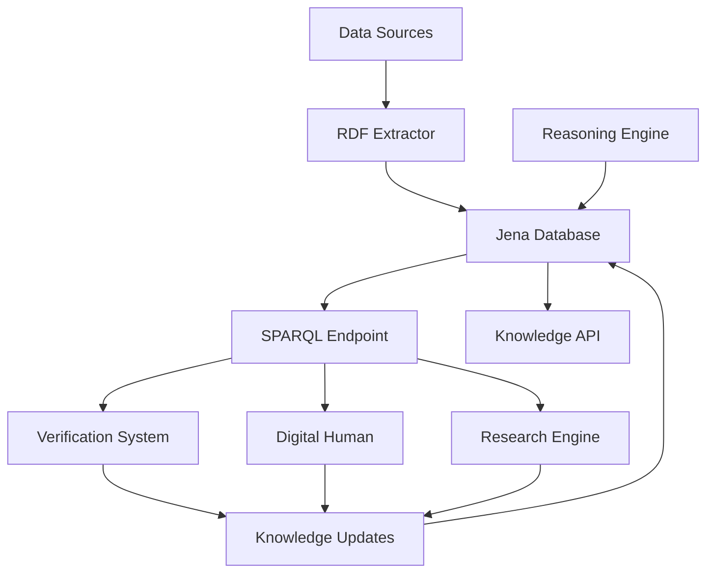

# Knowledge Graph Integration

## Overview

AIQToolkit integrates with Jena-based RDF knowledge graphs to provide semantic reasoning, fact storage, and relationship discovery. This guide explains how to integrate knowledge graphs with other AIQToolkit components.

## Architecture



## Core Components

### 1. Jena Database Integration

```python
# src/aiq/digital_human/persistence/jena_database.py

from SPARQLWrapper import SPARQLWrapper, JSON
import rdflib
from typing import List, Dict, Any

class JenaDatabase:
    def __init__(self, endpoint: str = "http://localhost:3030/knowledge"):
        self.endpoint = endpoint
        self.sparql = SPARQLWrapper(endpoint)
        self.graph = rdflib.Graph()
        
    def store_fact(
        self,
        subject: str,
        predicate: str,
        object: str,
        confidence: float = 1.0
    ) -> bool:
        """Store a fact in the knowledge graph"""
        
        # Create RDF triple with confidence
        query = f"""
        PREFIX aiq: <http://aiqtoolkit.com/ontology#>
        PREFIX xsd: <http://www.w3.org/2001/XMLSchema#>
        
        INSERT DATA {{
            <{subject}> <{predicate}> <{object}> .
            <{subject}> aiq:confidence "{confidence}"^^xsd:float .
            <{subject}> aiq:timestamp "{datetime.now().isoformat()}"^^xsd:dateTime .
        }}
        """
        
        self.sparql.setQuery(query)
        self.sparql.method = 'POST'
        return self.sparql.query()
        
    def query_knowledge(self, sparql_query: str) -> List[Dict[str, Any]]:
        """Execute SPARQL query on knowledge graph"""
        
        self.sparql.setQuery(sparql_query)
        self.sparql.setReturnFormat(JSON)
        results = self.sparql.query().convert()
        
        return [
            {
                var: binding[var]["value"]
                for var in results["head"]["vars"]
            }
            for binding in results["results"]["bindings"]
        ]
```

### 2. Knowledge Graph Builder

```python
# src/aiq/digital_human/knowledge/knowledge_graph_builder.py

import networkx as nx
from rdflib import Graph, Namespace, Literal, URIRef
from typing import List, Tuple, Dict, Any

class KnowledgeGraphBuilder:
    def __init__(self, base_uri: str = "http://aiqtoolkit.com/knowledge/"):
        self.graph = Graph()
        self.nx_graph = nx.DiGraph()
        self.base_uri = base_uri
        self.aiq = Namespace(f"{base_uri}ontology#")
        
    def add_entity(
        self,
        entity_id: str,
        entity_type: str,
        properties: Dict[str, Any]
    ) -> URIRef:
        """Add entity to knowledge graph"""
        
        entity_uri = URIRef(f"{self.base_uri}{entity_id}")
        
        # Add type
        self.graph.add((
            entity_uri,
            RDF.type,
            self.aiq[entity_type]
        ))
        
        # Add properties
        for prop, value in properties.items():
            if isinstance(value, str):
                self.graph.add((
                    entity_uri,
                    self.aiq[prop],
                    Literal(value)
                ))
            elif isinstance(value, (int, float)):
                self.graph.add((
                    entity_uri,
                    self.aiq[prop],
                    Literal(value, datatype=XSD.decimal)
                ))
                
        # Add to NetworkX for graph algorithms
        self.nx_graph.add_node(entity_id, **properties)
        
        return entity_uri
        
    def add_relationship(
        self,
        subject_id: str,
        predicate: str,
        object_id: str,
        properties: Dict[str, Any] = None
    ):
        """Add relationship between entities"""
        
        subject_uri = URIRef(f"{self.base_uri}{subject_id}")
        object_uri = URIRef(f"{self.base_uri}{object_id}")
        predicate_uri = self.aiq[predicate]
        
        # Add to RDF graph
        self.graph.add((subject_uri, predicate_uri, object_uri))
        
        # Add to NetworkX graph
        self.nx_graph.add_edge(
            subject_id,
            object_id,
            predicate=predicate,
            **(properties or {})
        )
        
    def compute_centrality(self) -> Dict[str, float]:
        """Compute entity importance using centrality measures"""
        
        # PageRank for importance
        pagerank = nx.pagerank(self.nx_graph)
        
        # Betweenness centrality for influence
        betweenness = nx.betweenness_centrality(self.nx_graph)
        
        # Combine metrics
        centrality = {}
        for node in self.nx_graph.nodes():
            centrality[node] = (
                0.7 * pagerank.get(node, 0) +
                0.3 * betweenness.get(node, 0)
            )
            
        return centrality
```

### 3. Semantic Reasoning Integration

```python
# src/aiq/digital_human/knowledge/semantic_reasoner.py

from owlready2 import *
import rdflib
from typing import List, Dict, Any

class SemanticReasoner:
    def __init__(self, ontology_file: str):
        self.onto = get_ontology(ontology_file).load()
        self.reasoner = Reasoner()
        
    def infer_relationships(
        self,
        facts: List[Tuple[str, str, str]]
    ) -> List[Tuple[str, str, str]]:
        """Infer new relationships from existing facts"""
        
        # Add facts to ontology
        with self.onto:
            for subject, predicate, obj in facts:
                # Create individuals if not exist
                if not self.onto[subject]:
                    Individual(subject, namespace=self.onto)
                if not self.onto[obj]:
                    Individual(obj, namespace=self.onto)
                    
                # Add relationship
                subj_ind = self.onto[subject]
                obj_ind = self.onto[obj]
                prop = self.onto[predicate]
                
                if prop:
                    prop[subj_ind].append(obj_ind)
        
        # Run reasoner
        with self.onto:
            sync_reasoner()
            
        # Extract inferred facts
        inferred = []
        for prop in self.onto.object_properties():
            for subj, obj in prop.get_relations():
                triple = (subj.name, prop.name, obj.name)
                if triple not in facts:
                    inferred.append(triple)
                    
        return inferred
```

## Integration Examples

### Example 1: Verification with Knowledge Graph

```python
class KnowledgeEnhancedVerification:
    def __init__(self):
        self.verification = VerificationSystem()
        self.knowledge_graph = JenaDatabase()
        self.reasoner = SemanticReasoner("ontology/aiq.owl")
        
    async def verify_with_knowledge(
        self,
        claim: str,
        sources: List[Source]
    ) -> VerificationResult:
        # Extract entities and relationships from claim
        entities = await self.extract_entities(claim)
        relationships = await self.extract_relationships(claim)
        
        # Query existing knowledge
        existing_knowledge = self.query_related_facts(entities)
        
        # Enhance sources with knowledge graph
        enhanced_sources = sources + [
            Source(
                content=fact["content"],
                type="knowledge_graph",
                confidence=float(fact["confidence"])
            )
            for fact in existing_knowledge
        ]
        
        # Verify with enhanced sources
        result = await self.verification.verify_claim(
            claim, enhanced_sources
        )
        
        # Update knowledge graph if high confidence
        if result.confidence > 0.9:
            await self.update_knowledge_graph(claim, result)
            
        return result
        
    async def update_knowledge_graph(
        self,
        claim: str,
        result: VerificationResult
    ):
        """Update knowledge graph with verified facts"""
        
        # Extract triples from claim
        triples = await self.extract_triples(claim)
        
        # Store with confidence scores
        for subject, predicate, object in triples:
            self.knowledge_graph.store_fact(
                subject=subject,
                predicate=predicate,
                object=object,
                confidence=result.confidence
            )
            
        # Run reasoning to infer new facts
        inferred = self.reasoner.infer_relationships(triples)
        
        # Store inferred facts with reduced confidence
        for triple in inferred:
            self.knowledge_graph.store_fact(
                subject=triple[0],
                predicate=triple[1],
                object=triple[2],
                confidence=result.confidence * 0.8
            )
```

### Example 2: Digital Human with Knowledge Context

```python
class KnowledgeAwareDigitalHuman:
    def __init__(self):
        self.conversation_engine = SgLangConversationEngine()
        self.knowledge_graph = JenaDatabase()
        self.graph_builder = KnowledgeGraphBuilder()
        
    async def contextualized_response(
        self,
        user_query: str,
        conversation_history: List[Message]
    ) -> Response:
        # Extract entities from query
        entities = await self.extract_entities(user_query)
        
        # Get relevant knowledge
        context = await self.get_knowledge_context(entities)
        
        # Build conversation graph
        conv_graph = self.build_conversation_graph(
            conversation_history
        )
        
        # Compute entity importance
        centrality = conv_graph.compute_centrality()
        
        # Prioritize important entities
        important_entities = sorted(
            entities,
            key=lambda e: centrality.get(e.id, 0),
            reverse=True
        )[:5]
        
        # Generate response with knowledge context
        response = await self.conversation_engine.generate(
            query=user_query,
            context=context,
            important_entities=important_entities
        )
        
        # Update knowledge graph with new information
        await self.update_from_conversation(
            user_query, response
        )
        
        return response
```

### Example 3: Research with Knowledge Discovery

```python
class KnowledgeGuidedResearch:
    def __init__(self):
        self.research_engine = ResearchTaskExecutor()
        self.knowledge_graph = JenaDatabase()
        self.graph_builder = KnowledgeGraphBuilder()
        
    async def research_with_discovery(
        self,
        research_question: str
    ) -> ResearchResult:
        # Query existing knowledge
        existing = await self.query_research_knowledge(
            research_question
        )
        
        # Identify knowledge gaps
        gaps = await self.identify_knowledge_gaps(
            research_question, existing
        )
        
        # Focus research on gaps
        research_tasks = self.create_gap_focused_tasks(gaps)
        
        # Execute research
        results = await self.research_engine.execute_tasks(
            research_tasks
        )
        
        # Build research knowledge graph
        research_graph = self.build_research_graph(results)
        
        # Discover new relationships
        discoveries = self.discover_relationships(research_graph)
        
        # Store discoveries
        for discovery in discoveries:
            await self.store_discovery(discovery)
            
        return ResearchResult(
            findings=results,
            discoveries=discoveries,
            knowledge_graph=research_graph
        )
```

## SPARQL Query Examples

### Complex Knowledge Queries

```sparql
# Find all verified facts about a company
PREFIX aiq: <http://aiqtoolkit.com/ontology#>
PREFIX xsd: <http://www.w3.org/2001/XMLSchema#>

SELECT ?fact ?confidence ?timestamp
WHERE {
    ?fact aiq:about <http://aiqtoolkit.com/entities/Apple> .
    ?fact aiq:confidence ?confidence .
    ?fact aiq:timestamp ?timestamp .
    FILTER(?confidence > 0.8)
}
ORDER BY DESC(?timestamp)
LIMIT 100

# Find relationships between entities
SELECT ?entity1 ?relation ?entity2 ?confidence
WHERE {
    ?entity1 ?relation ?entity2 .
    ?entity1 aiq:type "Company" .
    ?entity2 aiq:type "Technology" .
    ?entity1 aiq:confidence ?confidence .
}
ORDER BY DESC(?confidence)

# Discover indirect relationships
SELECT ?start ?middle ?end ?path_confidence
WHERE {
    ?start aiq:related_to ?middle .
    ?middle aiq:related_to ?end .
    ?start aiq:confidence ?conf1 .
    ?middle aiq:confidence ?conf2 .
    BIND(?conf1 * ?conf2 AS ?path_confidence)
    FILTER(?path_confidence > 0.6)
}
```

## Configuration

### Knowledge Graph Settings

```yaml
# config/knowledge-graph.yml

knowledge_graph:
  jena:
    endpoint: "http://localhost:3030/knowledge"
    dataset: "aiqtoolkit"
    timeout: 5000
    
  ontology:
    base_uri: "http://aiqtoolkit.com/ontology#"
    file: "resources/aiq_ontology.owl"
    
  storage:
    backend: "tdb2"
    path: "/data/knowledge"
    journal_mode: "WAL"
    
  reasoning:
    enabled: true
    reasoner: "pellet"
    inference_rules:
      - "rdfs"
      - "owl"
      - "custom_rules.jena"
      
  caching:
    enabled: true
    ttl: 3600
    max_size: 10000
```

## Performance Optimization

### Graph Query Optimization

```python
class OptimizedKnowledgeQuery:
    def __init__(self):
        self.cache = TTLCache(maxsize=10000, ttl=3600)
        self.query_planner = SPARQLQueryPlanner()
        
    async def optimized_query(
        self,
        sparql: str,
        parameters: Dict[str, Any] = None
    ) -> List[Dict[str, Any]]:
        # Check cache
        cache_key = self.get_cache_key(sparql, parameters)
        if cache_key in self.cache:
            return self.cache[cache_key]
            
        # Optimize query plan
        optimized = self.query_planner.optimize(sparql)
        
        # Execute with batching
        results = await self.execute_batched(
            optimized, parameters
        )
        
        # Cache results
        self.cache[cache_key] = results
        
        return results
        
    async def execute_batched(
        self,
        query: str,
        parameters: Dict[str, Any]
    ) -> List[Dict[str, Any]]:
        # Split large queries
        if self.is_large_query(query):
            batches = self.split_query(query)
            results = []
            
            for batch in batches:
                batch_result = await self.execute_single(
                    batch, parameters
                )
                results.extend(batch_result)
                
            return results
        else:
            return await self.execute_single(query, parameters)
```

### Graph Indexing

```python
class IndexedKnowledgeGraph:
    def __init__(self):
        self.graph = JenaDatabase()
        self.indices = {}
        
    def create_indices(self):
        """Create indices for common query patterns"""
        
        # Entity type index
        self.indices['entity_type'] = self.build_entity_type_index()
        
        # Relationship index
        self.indices['relationships'] = self.build_relationship_index()
        
        # Temporal index
        self.indices['temporal'] = self.build_temporal_index()
        
        # Confidence index
        self.indices['confidence'] = self.build_confidence_index()
        
    def build_entity_type_index(self) -> Dict[str, List[str]]:
        """Index entities by type for fast lookup"""
        
        query = """
        SELECT ?entity ?type
        WHERE {
            ?entity rdf:type ?type .
        }
        """
        
        results = self.graph.query_knowledge(query)
        
        index = defaultdict(list)
        for result in results:
            index[result['type']].append(result['entity'])
            
        return dict(index)
```

## Monitoring and Analytics

### Knowledge Graph Metrics

```python
class KnowledgeGraphMetrics:
    def __init__(self):
        self.graph = JenaDatabase()
        self.metrics = MetricsCollector()
        
    async def collect_metrics(self):
        """Collect knowledge graph metrics"""
        
        # Graph size metrics
        triple_count = await self.count_triples()
        entity_count = await self.count_entities()
        relationship_count = await self.count_relationships()
        
        self.metrics.gauge('knowledge_graph_triples', triple_count)
        self.metrics.gauge('knowledge_graph_entities', entity_count)
        self.metrics.gauge('knowledge_graph_relationships', relationship_count)
        
        # Quality metrics
        avg_confidence = await self.average_confidence()
        verification_rate = await self.verification_rate()
        
        self.metrics.gauge('knowledge_graph_avg_confidence', avg_confidence)
        self.metrics.gauge('knowledge_graph_verification_rate', verification_rate)
        
        # Usage metrics
        query_rate = await self.query_rate()
        update_rate = await self.update_rate()
        
        self.metrics.gauge('knowledge_graph_query_rate', query_rate)
        self.metrics.gauge('knowledge_graph_update_rate', update_rate)
```

## Testing

### Knowledge Graph Tests

```python
import pytest
from aiq.knowledge import JenaDatabase, KnowledgeGraphBuilder

@pytest.mark.asyncio
async def test_knowledge_integration():
    # Setup
    kg = JenaDatabase("http://localhost:3030/test")
    builder = KnowledgeGraphBuilder()
    
    # Add test entities
    entity1 = builder.add_entity(
        "apple_inc",
        "Company",
        {"name": "Apple Inc.", "industry": "Technology"}
    )
    
    entity2 = builder.add_entity(
        "iphone",
        "Product",
        {"name": "iPhone", "category": "Smartphone"}
    )
    
    # Add relationship
    builder.add_relationship(
        "apple_inc",
        "manufactures",
        "iphone",
        {"since": "2007"}
    )
    
    # Test query
    query = """
    SELECT ?product
    WHERE {
        <http://aiqtoolkit.com/knowledge/apple_inc> 
        <http://aiqtoolkit.com/ontology#manufactures> 
        ?product .
    }
    """
    
    results = kg.query_knowledge(query)
    assert len(results) == 1
    assert "iphone" in results[0]["product"]
```

## Production Deployment

### Knowledge Graph Infrastructure

```yaml
# kubernetes/knowledge-graph-deployment.yaml

apiVersion: apps/v1
kind: Deployment
metadata:
  name: jena-knowledge-graph
spec:
  replicas: 3
  selector:
    matchLabels:
      app: jena-kg
  template:
    metadata:
      labels:
        app: jena-kg
    spec:
      containers:
      - name: jena
        image: stain/jena-fuseki:latest
        ports:
        - containerPort: 3030
        env:
        - name: ADMIN_PASSWORD
          valueFrom:
            secretKeyRef:
              name: jena-secret
              key: admin-password
        volumeMounts:
        - name: data
          mountPath: /fuseki
        resources:
          requests:
            memory: "8Gi"
            cpu: "2"
          limits:
            memory: "16Gi"
            cpu: "4"
      volumes:
      - name: data
        persistentVolumeClaim:
          claimName: jena-data-pvc
---
apiVersion: v1
kind: Service
metadata:
  name: jena-service
spec:
  selector:
    app: jena-kg
  ports:
  - port: 3030
    targetPort: 3030
  type: ClusterIP
```

## Best Practices

1. **Schema Design**: Design ontology carefully before implementation
2. **Indexing**: Create appropriate indices for query patterns
3. **Caching**: Cache frequently accessed knowledge
4. **Versioning**: Track knowledge graph changes over time
5. **Validation**: Validate data before storing in graph
6. **Backup**: Regular backups of knowledge graph data

## Troubleshooting

### Common Issues

1. **Slow queries**: Check query complexity and add indices
2. **Memory issues**: Tune Jena cache settings
3. **Consistency problems**: Ensure proper transaction handling
4. **Import failures**: Validate RDF syntax and ontology compatibility

### Debug Commands

```bash
# Check Jena status
curl http://localhost:3030/$/ping

# View dataset statistics
curl http://localhost:3030/knowledge/stats

# Export knowledge graph
curl -X GET http://localhost:3030/knowledge/data \
  -H "Accept: application/n-triples" > backup.nt

# Validate ontology
rapper -i rdfxml -c ontology/aiq.owl

# Test SPARQL endpoint
curl -X POST http://localhost:3030/knowledge/sparql \
  -H "Content-Type: application/sparql-query" \
  -d "SELECT * WHERE { ?s ?p ?o } LIMIT 10"
```

## Next Steps

- Explore [System Architecture](architecture.md)
- Learn about [Performance Optimization](../performance/index.md)
- Review [Security Best Practices](../security/index.md)