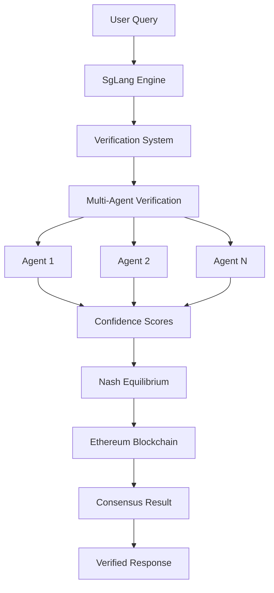

# Verification-Consensus Integration

## Overview

The integration between the Verification System and Nash-Ethereum Consensus in AIQToolkit creates a trustworthy, decentralized fact-checking mechanism with game-theoretic incentives. This guide explains how these components work together to ensure reliable information processing.

## Architecture



## Core Integration Points

### 1. Conversation Engine Integration

```python
# src/aiq/digital_human/conversation/sglang_engine.py

class SgLangConversationEngine:
    def __init__(self, config: SgLangConfig):
        self.verification_system = VerificationSystem()
        self.consensus_manager = NashEthereumConsensus()
        
    async def process_with_consensus(
        self,
        prompt: str,
        sources: List[Dict[str, Any]]
    ) -> ConversationResult:
        # Multi-agent consensus with verification
        tasks = []
        for i in range(self.config.num_agents):
            tasks.append(self._agent_verify(i, prompt, sources))
            
        agent_results = await asyncio.gather(*tasks)
        
        # Nash equilibrium computation
        consensus_result = await self.consensus_manager.compute_consensus(
            agent_results,
            verification_scores=[r.confidence for r in agent_results]
        )
        
        return ConversationResult(
            response=consensus_result.response,
            verification=consensus_result.verification_proof,
            consensus_proof=consensus_result.blockchain_proof
        )
```

### 2. Verification Data Flow

```python
# Integration flow between components

async def verification_consensus_pipeline(
    claim: str,
    sources: List[Source]
) -> VerifiedResult:
    # Step 1: Initial verification
    verification_result = await verification_system.verify_claim(
        claim, sources
    )
    
    # Step 2: Multi-agent validation
    agent_scores = await multi_agent_validate(
        claim,
        verification_result
    )
    
    # Step 3: Nash equilibrium computation
    nash_result = nash_consensus.compute_equilibrium(
        agent_scores,
        verification_result.confidence_scores
    )
    
    # Step 4: Blockchain recording
    blockchain_proof = await ethereum_client.record_consensus(
        nash_result,
        verification_result.prov_record
    )
    
    return VerifiedResult(
        confidence=nash_result.equilibrium_score,
        blockchain_proof=blockchain_proof,
        verification_details=verification_result
    )
```

## Configuration

### Verification-Consensus Settings

```yaml
# config/verification-consensus.yml

verification:
  confidence_threshold: 0.85
  required_sources: 3
  verification_methods:
    - bayesian
    - fuzzy_logic
    - dempster_shafer
  
consensus:
  num_agents: 5
  nash_iterations: 100
  convergence_threshold: 0.001
  blockchain:
    network: "ethereum"
    contract_address: "0x..."
    gas_limit: 3000000
    
integration:
  timeout_ms: 10000
  retry_attempts: 3
  cache_ttl: 3600
  parallel_verification: true
```

## Smart Contract Integration

### ConsensusVerification Contract

```solidity
// contracts/ConsensusVerification.sol

pragma solidity ^0.8.0;

contract ConsensusVerification {
    struct VerificationRecord {
        bytes32 claimHash;
        uint256 confidenceScore;
        bytes32 provHash;
        address[] validators;
        uint256 timestamp;
    }
    
    mapping(bytes32 => VerificationRecord) public verifications;
    
    event VerificationRecorded(
        bytes32 indexed claimHash,
        uint256 confidence,
        bytes32 provHash
    );
    
    function recordVerification(
        bytes32 _claimHash,
        uint256 _confidence,
        bytes32 _provHash,
        address[] memory _validators
    ) public {
        require(_confidence <= 10000, "Invalid confidence");
        require(_validators.length > 0, "No validators");
        
        verifications[_claimHash] = VerificationRecord({
            claimHash: _claimHash,
            confidenceScore: _confidence,
            provHash: _provHash,
            validators: _validators,
            timestamp: block.timestamp
        });
        
        emit VerificationRecorded(_claimHash, _confidence, _provHash);
    }
    
    function getVerification(bytes32 _claimHash) 
        public 
        view 
        returns (VerificationRecord memory) 
    {
        return verifications[_claimHash];
    }
}
```

## Implementation Examples

### Example 1: Financial Fact Verification

```python
async def verify_financial_claim(claim: str) -> VerifiedResult:
    """Verify financial claims with consensus"""
    
    # Get financial data sources
    sources = await financial_data_provider.get_sources(claim)
    
    # Configure verification for financial domain
    verification_config = VerificationConfig(
        domain="finance",
        confidence_methods=["bayesian", "fuzzy_logic"],
        min_confidence=0.9
    )
    
    # Run verification with consensus
    result = await verification_consensus_pipeline(
        claim=claim,
        sources=sources,
        config=verification_config
    )
    
    # Record on blockchain if high confidence
    if result.confidence > 0.95:
        await record_high_confidence_claim(result)
    
    return result
```

### Example 2: Multi-Agent News Verification

```python
class NewsVerificationConsensus:
    def __init__(self):
        self.verification = VerificationSystem()
        self.consensus = NashEthereumConsensus()
        
    async def verify_news(
        self,
        article: NewsArticle
    ) -> ConsensusResult:
        # Extract claims from article
        claims = await self.extract_claims(article)
        
        # Verify each claim with multiple agents
        verification_tasks = []
        for claim in claims:
            for agent_id in range(5):
                task = self.agent_verify(agent_id, claim)
                verification_tasks.append(task)
        
        # Gather all verification results
        all_results = await asyncio.gather(*verification_tasks)
        
        # Group by claim and compute consensus
        consensus_results = {}
        for claim in claims:
            claim_results = [r for r in all_results if r.claim == claim]
            consensus = await self.consensus.compute(claim_results)
            consensus_results[claim] = consensus
        
        # Aggregate final article confidence
        article_confidence = self.aggregate_confidence(consensus_results)
        
        return ConsensusResult(
            article=article,
            claim_results=consensus_results,
            overall_confidence=article_confidence,
            blockchain_proof=await self.record_consensus(consensus_results)
        )
```

## Performance Optimization

### Parallel Processing

```python
class OptimizedVerificationConsensus:
    def __init__(self):
        self.executor = ThreadPoolExecutor(max_workers=10)
        self.gpu_accelerator = CUDAAccelerator()
        
    async def fast_verify(
        self,
        claims: List[str],
        sources: List[Source]
    ) -> List[VerifiedResult]:
        # GPU-accelerated similarity computation
        similarity_matrix = await self.gpu_accelerator.compute_similarities(
            claims, sources
        )
        
        # Parallel verification
        verification_futures = []
        for i, claim in enumerate(claims):
            relevant_sources = self.get_relevant_sources(
                similarity_matrix[i], sources
            )
            future = self.executor.submit(
                self.verify_single, claim, relevant_sources
            )
            verification_futures.append(future)
        
        # Wait for all verifications
        verification_results = await asyncio.gather(
            *[asyncio.wrap_future(f) for f in verification_futures]
        )
        
        # Batch consensus computation
        consensus_result = await self.consensus.batch_compute(
            verification_results
        )
        
        return consensus_result
```

### Caching Strategy

```python
class CachedVerificationConsensus:
    def __init__(self):
        self.redis_client = redis.Redis()
        self.cache_ttl = 3600  # 1 hour
        
    async def verify_with_cache(
        self,
        claim: str,
        sources: List[Source]
    ) -> VerifiedResult:
        # Check cache first
        cache_key = self.generate_cache_key(claim, sources)
        cached_result = await self.get_cached(cache_key)
        
        if cached_result:
            return cached_result
        
        # Perform verification and consensus
        result = await self.verification_consensus_pipeline(
            claim, sources
        )
        
        # Cache high-confidence results
        if result.confidence > 0.9:
            await self.cache_result(cache_key, result)
        
        return result
```

## Monitoring and Analytics

### Metrics Collection

```python
class VerificationConsensusMetrics:
    def __init__(self):
        self.metrics_client = PrometheusClient()
        
    async def track_verification(self, result: VerifiedResult):
        # Track verification metrics
        self.metrics_client.gauge(
            'verification_confidence',
            result.confidence,
            labels={
                'method': result.primary_method,
                'domain': result.domain
            }
        )
        
        # Track consensus metrics
        self.metrics_client.histogram(
            'consensus_computation_time',
            result.consensus_time_ms,
            labels={'num_agents': result.num_agents}
        )
        
        # Track blockchain metrics
        self.metrics_client.counter(
            'blockchain_records',
            1,
            labels={
                'confidence_bucket': self.get_confidence_bucket(
                    result.confidence
                )
            }
        )
```

## Error Handling

### Graceful Degradation

```python
class ResilientVerificationConsensus:
    async def verify_with_fallback(
        self,
        claim: str,
        sources: List[Source]
    ) -> VerifiedResult:
        try:
            # Try full consensus pipeline
            return await self.full_verification_consensus(claim, sources)
            
        except ConsensusTimeoutError:
            # Fall back to simple majority
            return await self.simple_majority_consensus(claim, sources)
            
        except BlockchainConnectionError:
            # Continue without blockchain recording
            result = await self.verification_only(claim, sources)
            result.blockchain_status = "unavailable"
            return result
            
        except VerificationError as e:
            # Return minimal result
            return VerifiedResult(
                claim=claim,
                confidence=0.0,
                error=str(e),
                status="failed"
            )
```

## Testing

### Integration Tests

```python
import pytest
from aiq.verification import VerificationSystem
from aiq.neural import NashEthereumConsensus

@pytest.mark.asyncio
async def test_verification_consensus_integration():
    # Setup
    verification = VerificationSystem()
    consensus = NashEthereumConsensus()
    
    # Test claim
    claim = "The S&P 500 rose 2% today"
    sources = [
        {"source": "Reuters", "content": "S&P 500 gains 2%"},
        {"source": "Bloomberg", "content": "Market up 2%"},
        {"source": "CNBC", "content": "S&P rallies 2%"}
    ]
    
    # Verify claim
    verification_result = await verification.verify_claim(claim, sources)
    assert verification_result.confidence > 0.8
    
    # Test consensus
    agent_results = [verification_result] * 3
    consensus_result = await consensus.compute_consensus(agent_results)
    assert consensus_result.equilibrium_score > 0.85
    
    # Test blockchain recording
    blockchain_proof = await consensus.record_to_blockchain(
        consensus_result
    )
    assert blockchain_proof.transaction_hash
```

## Production Deployment

### Deployment Configuration

```yaml
# kubernetes/verification-consensus-deployment.yaml

apiVersion: apps/v1
kind: Deployment
metadata:
  name: verification-consensus
spec:
  replicas: 3
  selector:
    matchLabels:
      app: verification-consensus
  template:
    metadata:
      labels:
        app: verification-consensus
    spec:
      containers:
      - name: verification-engine
        image: aiqtoolkit/verification:latest
        resources:
          requests:
            memory: "4Gi"
            cpu: "2"
          limits:
            memory: "8Gi"
            cpu: "4"
        env:
        - name: CONSENSUS_ENABLED
          value: "true"
        - name: BLOCKCHAIN_NETWORK
          value: "ethereum"
      - name: consensus-engine
        image: aiqtoolkit/consensus:latest
        resources:
          requests:
            memory: "2Gi"
            cpu: "1"
            nvidia.com/gpu: 1
          limits:
            memory: "4Gi"
            cpu: "2"
            nvidia.com/gpu: 1
```

## Best Practices

1. **Always verify before consensus**: Ensure claims are verified before computing consensus
2. **Set appropriate timeouts**: Configure timeouts for both verification and consensus
3. **Handle blockchain failures gracefully**: System should work even if blockchain is unavailable
4. **Monitor confidence scores**: Track and alert on low confidence results
5. **Use caching wisely**: Cache high-confidence results to improve performance
6. **Test edge cases**: Ensure system handles conflicting sources and low-confidence scenarios

## Troubleshooting

### Common Issues

1. **Consensus timeout**: Increase timeout or reduce number of agents
2. **Blockchain connection errors**: Check network configuration and gas limits
3. **Low confidence scores**: Review source quality and verification methods
4. **Memory issues**: Optimize batch sizes and implement pagination

### Debug Commands

```bash
# Check verification-consensus status
kubectl logs -l app=verification-consensus

# Monitor metrics
curl http://localhost:9090/metrics | grep verification

# Test blockchain connection
aiq test blockchain --network ethereum

# Validate configuration
aiq validate --config verification-consensus.yml
```

## Next Steps

- Learn about [Knowledge Graph Integration](knowledge-graph.md)
- Explore [Architecture Patterns](architecture.md)
- Review [Performance Optimization](../performance/index.md)