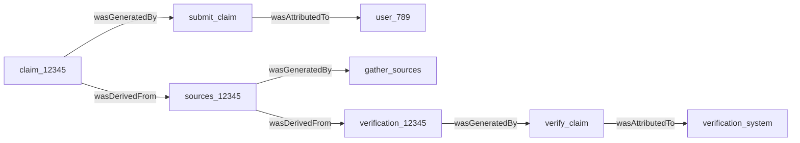

# Provenance Tracking

## Overview

The verification system implements W3C PROV-compliant provenance tracking to maintain complete audit trails of all verification activities. This ensures transparency, accountability, and compliance with data governance requirements.

## W3C PROV Data Model

The system uses the W3C PROV standard, which defines three core concepts:

- **Entities**: Things being tracked (claims, documents, verification results)
- **Activities**: Processes that use or generate entities (verification, validation)
- **Agents**: People, organizations, or software responsible for activities

## Implementation

### ProvenanceRecord

```python
@dataclass
class ProvenanceRecord:
    entity_id: str           # Unique identifier for the entity
    activity_id: str         # Activity that created/used the entity
    agent_id: str           # Agent responsible for the activity
    timestamp: datetime      # When the activity occurred
    derivation: Optional[str] = None    # How entity was derived
    attribution: Optional[str] = None   # Who/what is attributed
```

### ProvenanceTracker

```python
class ProvenanceTracker:
    def __init__(self):
        self.records: List[ProvenanceRecord] = []
    
    def add_record(
        self,
        entity_id: str,
        activity_id: str,
        agent_id: str,
        derivation: Optional[str] = None,
        attribution: Optional[str] = None
    ) -> ProvenanceRecord:
        """Add a provenance record to the chain"""
        record = ProvenanceRecord(
            entity_id=entity_id,
            activity_id=activity_id,
            agent_id=agent_id,
            timestamp=datetime.now(),
            derivation=derivation,
            attribution=attribution
        )
        self.records.append(record)
        return record
```

## Provenance Relationships

### Key PROV Relationships

1. **wasGeneratedBy**: Entity was generated by an activity
2. **used**: Activity used an entity
3. **wasAttributedTo**: Entity was attributed to an agent
4. **wasDerivedFrom**: Entity was derived from another entity
5. **wasInformedBy**: Activity used information from another activity

### Example Provenance Chain

```python
# Verification creates a provenance chain
tracker = ProvenanceTracker()

# 1. Claim submission
tracker.add_record(
    entity_id="claim_12345",
    activity_id="submit_claim",
    agent_id="user_789",
    attribution="Original claim by user"
)

# 2. Source gathering
tracker.add_record(
    entity_id="sources_12345",
    activity_id="gather_sources",
    agent_id="source_collector",
    derivation="claim_12345"
)

# 3. Verification process
tracker.add_record(
    entity_id="verification_12345",
    activity_id="verify_claim",
    agent_id="verification_system",
    derivation="sources_12345"
)
```

## Provenance Visualization

The system can export provenance as different formats:

### PROV-N Format

```
entity(claim_12345, [type="claim", content="..."])
entity(sources_12345, [type="source_collection"])
entity(verification_12345, [type="verification_result"])

activity(submit_claim, 2024-01-15T10:30:00)
activity(gather_sources, 2024-01-15T10:30:05)
activity(verify_claim, 2024-01-15T10:30:10)

agent(user_789, [type="human"])
agent(verification_system, [type="software"])

wasGeneratedBy(claim_12345, submit_claim)
wasGeneratedBy(sources_12345, gather_sources)
wasGeneratedBy(verification_12345, verify_claim)

wasAttributedTo(claim_12345, user_789)
wasAttributedTo(verification_12345, verification_system)

wasDerivedFrom(sources_12345, claim_12345)
wasDerivedFrom(verification_12345, sources_12345)
```

### PROV-JSON Format

```json
{
  "entity": {
    "claim_12345": {
      "type": "claim",
      "content": "..."
    },
    "verification_12345": {
      "type": "verification_result",
      "confidence": 0.92
    }
  },
  "activity": {
    "verify_claim": {
      "startTime": "2024-01-15T10:30:10Z",
      "endTime": "2024-01-15T10:30:15Z"
    }
  },
  "wasGeneratedBy": {
    "_:gen1": {
      "entity": "verification_12345",
      "activity": "verify_claim"
    }
  }
}
```

### Graphical Representation



## Integration with Blockchain

Provenance records can be stored on blockchain for immutability:

```python
class BlockchainProvenanceTracker(ProvenanceTracker):
    def __init__(self, web3_provider: str, contract_address: str):
        super().__init__()
        self.w3 = Web3(Web3.HTTPProvider(web3_provider))
        self.contract = self.w3.eth.contract(
            address=contract_address,
            abi=PROVENANCE_CONTRACT_ABI
        )
    
    async def add_record(self, *args, **kwargs) -> ProvenanceRecord:
        # Add to local chain
        record = super().add_record(*args, **kwargs)
        
        # Store on blockchain
        tx_hash = self.contract.functions.addProvenanceRecord(
            entity_id=record.entity_id,
            activity_id=record.activity_id,
            agent_id=record.agent_id,
            timestamp=int(record.timestamp.timestamp()),
            metadata=json.dumps({
                'derivation': record.derivation,
                'attribution': record.attribution
            })
        ).transact()
        
        # Wait for confirmation
        receipt = self.w3.eth.wait_for_transaction_receipt(tx_hash)
        record.blockchain_tx = receipt.transactionHash.hex()
        
        return record
```

## Querying Provenance

### Finding Entity History

```python
def get_entity_history(tracker: ProvenanceTracker, entity_id: str) -> List[ProvenanceRecord]:
    """Get all records related to an entity"""
    history = []
    
    # Direct records
    for record in tracker.records:
        if record.entity_id == entity_id:
            history.append(record)
    
    # Derived records
    for record in tracker.records:
        if record.derivation == entity_id:
            history.append(record)
    
    return sorted(history, key=lambda r: r.timestamp)
```

### Tracing Lineage

```python
def trace_lineage(tracker: ProvenanceTracker, entity_id: str) -> Dict[str, List[str]]:
    """Trace the complete lineage of an entity"""
    lineage = {
        'ancestors': [],
        'descendants': []
    }
    
    # Find ancestors (what this was derived from)
    current = entity_id
    while current:
        parent = None
        for record in tracker.records:
            if record.entity_id == current and record.derivation:
                parent = record.derivation
                lineage['ancestors'].append(parent)
                break
        current = parent
    
    # Find descendants (what was derived from this)
    for record in tracker.records:
        if record.derivation == entity_id:
            lineage['descendants'].append(record.entity_id)
    
    return lineage
```

## Use Cases

### Audit Trail

```python
# Complete audit trail for compliance
async def generate_audit_report(verification_id: str):
    tracker = verification_system.provenance_tracker
    history = get_entity_history(tracker, verification_id)
    
    report = {
        'verification_id': verification_id,
        'timeline': [],
        'agents_involved': set(),
        'sources_used': []
    }
    
    for record in history:
        report['timeline'].append({
            'timestamp': record.timestamp,
            'activity': record.activity_id,
            'agent': record.agent_id
        })
        report['agents_involved'].add(record.agent_id)
    
    return report
```

### Reproducibility

```python
# Reproduce verification with same sources
async def reproduce_verification(original_id: str):
    tracker = verification_system.provenance_tracker
    lineage = trace_lineage(tracker, original_id)
    
    # Find original sources
    source_records = [
        r for r in tracker.records 
        if r.entity_id in lineage['ancestors'] 
        and 'source' in r.entity_id
    ]
    
    # Re-run verification
    original_claim = get_claim_from_records(tracker, original_id)
    sources = reconstruct_sources(source_records)
    
    new_result = await verification_system.verify_claim(
        original_claim,
        sources
    )
    
    return {
        'original_id': original_id,
        'reproduction_id': new_result.provenance_chain[-1].entity_id,
        'confidence_match': abs(
            new_result.confidence - 
            get_original_confidence(tracker, original_id)
        ) < 0.01
    }
```

### Trust Assessment

```python
# Assess trust based on provenance
def assess_trust(tracker: ProvenanceTracker, entity_id: str) -> float:
    history = get_entity_history(tracker, entity_id)
    
    trust_factors = {
        'verified_sources': 0,
        'trusted_agents': 0,
        'blockchain_records': 0,
        'age': 0
    }
    
    for record in history:
        # Check if agent is trusted
        if is_trusted_agent(record.agent_id):
            trust_factors['trusted_agents'] += 1
        
        # Check if recorded on blockchain
        if hasattr(record, 'blockchain_tx'):
            trust_factors['blockchain_records'] += 1
        
        # Age factor (older = more tested)
        age_days = (datetime.now() - record.timestamp).days
        trust_factors['age'] = min(age_days / 30, 1.0)
    
    # Calculate weighted trust score
    weights = {
        'verified_sources': 0.3,
        'trusted_agents': 0.3,
        'blockchain_records': 0.2,
        'age': 0.2
    }
    
    trust_score = sum(
        trust_factors[k] * weights[k] 
        for k in trust_factors
    )
    
    return min(trust_score, 1.0)
```

## Best Practices

1. **Complete Recording**: Record all significant activities
2. **Unique Identifiers**: Use UUIDs or content hashes for entity IDs
3. **Timestamp Precision**: Use high-precision timestamps
4. **Agent Identification**: Clearly identify all agents (human and software)
5. **Relationship Clarity**: Use appropriate PROV relationships
6. **Immutable Storage**: Consider blockchain for critical provenance
7. **Regular Backups**: Backup provenance data separately from content
8. **Access Control**: Implement appropriate access controls for sensitive provenance

## Compliance and Standards

The provenance system helps meet various compliance requirements:

- **GDPR**: Right to explanation, data processing records
- **HIPAA**: Audit trails for protected health information
- **SOX**: Financial data verification trails
- **ISO 27001**: Information security audit requirements

## Export and Interoperability

### Export Formats

```python
# Export provenance in different formats
def export_provenance(tracker: ProvenanceTracker, format: str):
    if format == 'prov-n':
        return export_to_prov_n(tracker)
    elif format == 'prov-json':
        return export_to_prov_json(tracker)
    elif format == 'rdf':
        return export_to_rdf(tracker)
    elif format == 'graphml':
        return export_to_graphml(tracker)
```

### Integration with Other Systems

```python
# Share provenance with external systems
async def share_provenance(verification_id: str, endpoint: str):
    provenance_data = export_provenance(
        verification_system.provenance_tracker,
        format='prov-json'
    )
    
    response = await http_client.post(
        endpoint,
        json=provenance_data,
        headers={'Content-Type': 'application/provenance+json'}
    )
    
    return response.status_code == 200
```